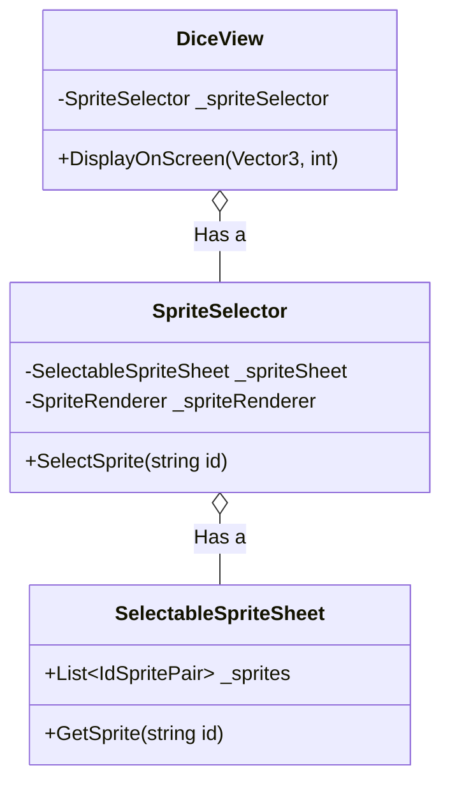

# sys_sprite_selector_design.md - Spriteセレクター設計書

---

## 概要

本設計は、「Cards and Dices」プロジェクトにおいて、GameObjectのSpriteをIDに基づいて動的に切り替えるための汎用的な拡張機能「Spriteセレクター」の技術的な実装を定義します。状態に応じて見た目が変わるUI要素（例: ダイスの出目、カードのステータスアイコン）に適用することを目的とします。

---

## クラスおよびコンポーネント設計

本システムは、スプライトのデータ定義と、それを表示に反映するビューコンポーネントの2つの主要クラスで構成されます。

### 1. データ定義 (Model)

- **`SelectableSpriteSheet` (ScriptableObject)**:
    - **継承**: `ScriptableObject`
    - 文字列IDとスプライトのペアのコレクションを保持するデータアセットです。
    - **プロパティ**:
        - `_sprites`: `IdSpritePair`（string Id, Sprite Sprite）のリスト。インスペクター上で設定します。
    - **責務**: 
        - 複数のスプライトを一つのアセットとしてグループ化します。
        - 実行時にIDからスプライトを高速に検索するためのキャッシュ（Dictionary）を内部に構築します。
    - **メソッド**:
        - `GetSprite(string id)`: 指定されたIDに対応するスプライトを返します。見つからない場合はnullを返します。

### 2. 表示クラス (ビュー)

- **`SpriteSelector` (MonoBehaviour)**:
    - **継承**: `MonoBehaviour`
    - `SelectableSpriteSheet` のデータに基づき、`SpriteRenderer` の表示を切り替える汎用コンポーネントです。
    - **プロパティ**:
        - `_spriteSheet`: 使用するスプライトの定義が格納された `SelectableSpriteSheet` アセット。
        - `_spriteRenderer`: 実際にスプライトを表示・変更する対象の `SpriteRenderer` コンポーネント。
    - **責務**: 外部からの指示に応じて、指定されたIDのスプライトを `SpriteRenderer` に設定します。自身ではどのスプライトを選択するかのロジックを持ちません。
    - **メソッド**:
        - `SelectSprite(string id)`: `_spriteSheet` からIDに対応するスプライトを取得し、`_spriteRenderer` に設定します。

---

## 主要な処理フロー

### 1. 基本的な処理フロー

1.  外部のクラス（ViewやPresenterなど）が、`SpriteSelector` コンポーネントの `SelectSprite(string id)` メソッドを呼び出します。
2.  `SpriteSelector` は、インスペクターで設定された `_spriteSheet` アセットの `GetSprite(id)` メソッドを呼び出します。
3.  `SelectableSpriteSheet` は、内部のDictionaryキャッシュからIDに一致する `Sprite` オブジェクトを検索し、返却します。
4.  `SpriteSelector` は、取得した `Sprite` オブジェクトを、インスペクターで設定された `_spriteRenderer` の `sprite` プロパティに設定します。
5.  `SpriteRenderer` の表示が新しいスプライトに更新されます。

### 2. DiceViewからの使用例

ダイスの出目に応じて表示スプライトを切り替える際のフローは以下の通りです。

1.  `DicePresenter` が `DisplayOnScreenEvent` を受信し、`DiceInstance` から出目の値（例: `4`）を取得します。
2.  `DicePresenter` は、`DiceView` の `DisplayOnScreen(homePosition, 4)` メソッドを呼び出します。
3.  `DiceView` の `DisplayOnScreen` メソッド内で、出目の値からスプライトID（例: `"Dice4"`）を生成します。
4.  `DiceView` は、自身が保持している `SpriteSelector` コンポーネントの `SelectSprite("Dice4")` メソッドを呼び出します。
5.  `SpriteSelector` は、`SelectableSpriteSheet` から `"Dice4"` に対応するスプライトを取得し、自身の `SpriteRenderer` に設定します。
6.  結果として、ダイスのGameObjectの見た目が4の目のスプライトに変わります。

---

## 関連ファイル

- [sys_identifiable-views.md](../sys/sys_identifiable-views.md)

---

## 更新履歴

- 2025-09-22: 初版 (Gemini)
