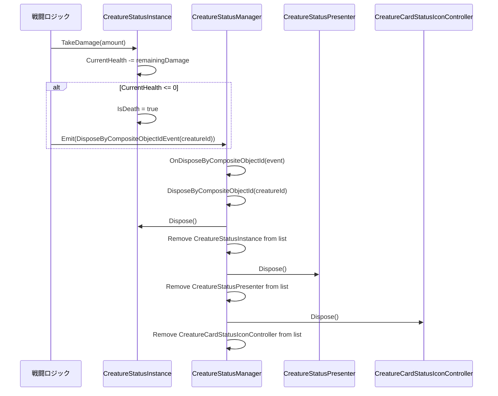
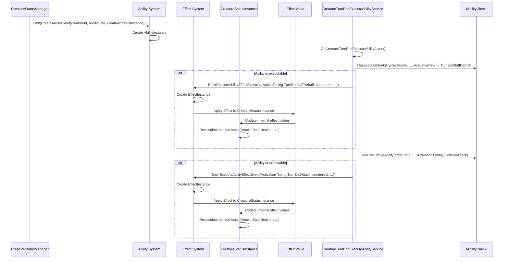

# sys_creature_status_management.md - クリーチャーカードステータス管理システム設計書

---

## 概要

本ドキュメントは、ゲーム「CardsAndDices」におけるクリーチャーカードのステータス管理システムについて記述します。このシステムは、クリーチャーの基本的な能力値（体力、攻撃力、シールドなど）の管理、状態変化（ダメージ、死亡、クールダウンなど）、およびアビリティやエフェクトとの連携を担います。

主要な設計思想として、関心の分離、データ駆動、イベント駆動を基盤とし、各コンポーネントが疎結合で連携することで、システムの柔軟性と拡張性を高めています。

---

## クラスおよびコンポーネント設計

### 1. データ定義 (ScriptableObject)

#### 1.1. `CreatureData`

*   **ファイル:** `Assets/CardsAndDices/Scripts/Combats/Data/Creatures/CreatureData.cs`
*   **責務:** クリーチャーの静的な基本データを定義します。これは、クリーチャーの種類ごとに固定される情報であり、ゲーム中に直接変更されることはありません。
*   **プロパティ:**
    *   `CreatureId`: クリーチャーを一意に識別するID。
    *   `Attack`: 基本攻撃力。
    *   `Health`: 基本体力。
    *   `Shield`: 基本シールド値。
    *   `Cooldown`: 基本クールダウンダイス数。
    *   `Energy`: 特殊な能力値（エネルギーなど）。
    *   `Abilities`: クリーチャーが持つ固有能力のリスト。
    *   `MainAttackScoresType`: 標準攻撃で使用する能力値のタイプ。
    *   `HitsPerMainAttack`: 標準攻撃の攻撃回数。
    *   `MainAttackAoE`: 標準攻撃の効果範囲。
*   **メソッド:**
    *   コンストラクタ: `CreatureData(CreatureIdEntity creatureId, int attack, int health, int shield, int cooldown, int energy, List<AbilityDataEntity> abilities, EffectTargetType mainAttackScoresType, int hitsPerMainAttack, AreaOfEffect mainAttackAoE)`

#### 1.2. `CreatureIdEntity`

*   **ファイル:** `Assets/CardsAndDices/Scripts/Combats/Data/EntityDefinition/CreatureIdEntity.cs`
*   **継承:** `BaseEntityDefinition`
*   **責務:** クリーチャーを一意に識別するためのScriptableObjectアセット。型安全なIDとして機能します。
*   **プロパティ:** なし
*   **メソッド:** なし

#### 1.3. `FixedCardInitializer`

*   **ファイル:** `Assets/CardsAndDices/Scripts/Combats/Data/Creatures/FixedCardInitializer.cs`
*   **継承:** `ScriptableObject`
*   **責務:** Unityエディタ上で設定された固定データから`CardInitializationData`を生成します。エネミーや召喚クリーチャーなど、インスペクターで設定されたデータに基づいてクリーチャーカードを初期化するのに使用されます。
*   **プロパティ:**
    *   `_creatureId`, `_attack`, `_health`, `_shield`, `_cooldown`, `_energy`, `_abilities`: クリーチャーの基本データ。
    *   `_appearanceProfile`: 外観プロファイル。
    *   `_inlet1ProfileId`, `inlet1Category`, `_inlet1RareAbilities`, `_inlet1LegendAbilities`: インレット1のデータ。
    *   `_inlet2ProfileId`, `inlet2Category`, `_inlet2RareAbilities`, `_inlet2LegendAbilities`: インレット2のデータ。
    *   `_mainAttackScoresType`, `_hitsPerMainAttack`, `_mainAttackAoE`: メイン攻撃データ。
*   **メソッド:**
    *   `CreateCardInitializationData(Team creatureDataTeam)`: 設定されたデータに基づいて`CardInitializationData`を生成します。

### 2. ランタイムインスタンス (Model)

#### 2.1. `CardInitializationData`

*   **ファイル:** `Assets/CardsAndDices/Scripts/Combats/Domain/Creatures/CardInitializationData.cs`
*   **責務:** カード生成に必要な全ての情報を集約するデータコンテナ（DTO）。クリーチャーの基本データ、インレット能力プロファイル、外観プロファイルを保持し、カード生成ロジックとデータソース間の結合を疎に保ちます。
*   **プロパティ:**
    *   `CreatureDataTeam`: クリーチャーが所属するチーム。
    *   `CreatureData`: 生成するカードのクリーチャーとしての基本データ。
    *   `InletPackageProfiles`: カードに付属する各インレットの能力を定義するプロファイルのリスト。
    *   `Appearance`: クリーチャーの外観を定義するプロファイル。
*   **メソッド:**
    *   コンストラクタ: `CardInitializationData(CreatureData creatureData, List<InletPackageProfile> profiles, AppearanceProfile appearance, Team creatureDataTeam)`

#### 2.2. `CreatureStatusInstance`

*   **ファイル:** `Assets/CardsAndDices/Scripts/Combats/Domain/Creatures/CreatureStatusInstance.cs`
*   **継承:** `IDisposable`, `IIdentifiableInstance`
*   **責務:** ゲーム中に存在する個々のクリーチャーカードの動的なステータスを管理するインスタンス。体力、シールド、クールダウンなどの現在値を保持し、ダメージ処理や状態変化を管理します。
*   **プロパティ:**
    *   `CompositeObjectId`: クリーチャーステータスを一意に識別するID。
    *   `CreatureDataTeam`: クリーチャーが所属するチーム。
    *   `CurrentHealth`, `BaseHealth`: 現在体力と基本体力。
    *   `Attack`: 現在攻撃力（エフェクトによる変動を含む）。
    *   `CurrentShield`, `BaseShield`: 現在シールド値と基本シールド値。
    *   `CurrentCooldown`, `BaseCooldown`: 現在クールダウンと基本クールダウン。
    *   `Energy`: 現在エネルギー（エフェクトによる変動を含む）。
    *   `HitsPerMainAttack`: メイン攻撃のヒット数。
    *   `MainAttack`, `MainAttackScoresType`, `MainAttackAoE`: メイン攻撃関連情報。
    *   `IsCooldownFinished`, `IsDamage`, `IsDeath`, `IsAttacker`, `IsTurnEndAbilityBuffDebuff`, `IsTurnEndAbilityAttack`, `IsReaction`: 各種状態フラグ。
*   **メソッド:**
    *   コンストラクタ: `CreatureStatusInstance(CompositeObjectId compositeObjectId, CreatureData data, IEffectValue iEffectValue, Team creatureDataTeam)`
    *   `ChangeCurrentValue(EffectTargetType effectTargetType, int addValue)`: 指定されたステータス値を変更します。
    *   `GetToTargetStatus(EffectTargetType targetStatusType)`: 指定されたターゲットステータス値を取得します。
    *   `SetIsAttacker(bool flg)`: 攻撃者フラグを設定します。
    *   `ResetAttackFlgs()`: 攻撃関連フラグをリセットします。
    *   `Dispose()`: インスタンスを破棄します。
    *   `TakeDamage(int amount)`: ダメージを受け、体力とシールドを計算します。死亡判定も行います。
    *   `OnCooldownFinished()`: クールダウン終了時の処理。
    *   `ResetTurnEndStatus()`: ターン終了時のステータスをリセットします。
    *   `ResetCoolDownStatus()`: クールダウンステータスをリセットします。
    *   `SetIsTurnEndAbilityAttack(bool flg)`: ターン終了時攻撃アビリティフラグを設定します。
    *   `SetIsTurnEndAbilityBuffDebuff(bool flg)`: ターン終了時バフ/デバフアビリティフラグを設定します。

#### 2.3. `ICreatureStatusInstanceRepository`

*   **ファイル:** `Assets/CardsAndDices/Scripts/Combats/Interfaces/ICreatureStatusInstanceRepository.cs`
*   **責務:** `CreatureStatusInstance`のコレクションへのアクセスを提供するインターフェース。
*   **メソッド:**
    *   `GetInstanceList()`: 全ての`CreatureStatusInstance`のリストを返します。
    *   `GetInstance(CompositeObjectId CompositeObjectId)`: 指定された`CompositeObjectId`に対応する`CreatureStatusInstance`を返します。

#### 2.4. `IEffectValue`

*   **ファイル:** `Assets/CardsAndDices/Scripts/Combats/Interfaces/IEffectValue.cs`
*   **責務:** エフェクトによって変動する値を取得するためのインターフェース。
*   **メソッド:**
    *   `GetTotalEffectValue(CompositeObjectId compositeObjectId, EffectTargetType type)`: 指定された`CompositeObjectId`と`EffectTargetType`に対応する合計エフェクト値を取得します。

### 3. 仲介クラス (Presenter / Controller)

#### 3.1. `CreatureStatusManager`

*   **ファイル:** `Assets/CardsAndDices/Scripts/Combats/Managers/CreatureCards/CreatureStatusManager.cs`
*   **継承:** `ScriptableObject`, `IDisposable`, `ICreatureStatusInstanceRepository`, `IIdentifiableManager`
*   **責務:** 全てのクリーチャーカードの`CreatureStatusInstance`を管理し、生成、更新、破棄を行います。イベントバスを介して他のシステムと連携し、クリーチャーの状態変化に応じた処理をトリガーします。
*   **プロパティ:**
    *   `_creatureStatusInstances`: 管理対象の`CreatureStatusInstance`のリスト。
    *   `_creatureStatusPresenters`: `CreatureStatusPresenter`のリスト。
    *   `_creatureCardStatusIconControllers`: `CreatureCardStatusIconController`のリスト。
    *   `_eventBus`: ゲームイベントバス。
    *   `_iTargetManager`: ターゲット管理インターフェース。
    *   `_viewRegistry`: ビューレジストリ。
    *   `_iEffectValue`: エフェクト値インターフェース。
    *   `_iAbilityCheck`: アビリティチェックインターフェース。
    *   `_creatureAttackService`: クリーチャー攻撃サービス。
    *   `_creatureTurnEndExecuteAbilityService`: ターン終了時アビリティ実行サービス。
*   **メソッド:**
    *   `Initialize(GameEventBus eventBus, ITargetManager iTargetManager, IdentifiableViewRegistry viewRegistry, IEffectValue iEffectValue, IAbilityCheck iAbilityCheck)`: 初期化処理。イベントの購読、サービスの生成を行います。
    *   `Dispose()`: リソースの解放、イベントの購読解除を行います。
    *   `OnResetTurnEnd(ResetTurnEndEvent evt)`: ターン終了時のステータスリセットイベントハンドラ。
    *   `OnResetCoolDown(ResetCoolDownEvent evt)`: クールダウンリセットイベントハンドラ。
    *   `OnCombatPhasePlayerCardOnScreen(CombatPhasePlayerCardOnScreenEvent evt)`: プレイヤーカード画面表示イベントハンドラ。
    *   `OnCombatPhaseEnemyCardOnScreen(CombatPhaseEnemyCardOnScreenEvent evt)`: エネミーカード画面表示イベントハンドラ。
    *   `OnCreateCreature(CreateCreatureEvent evt)`: クリーチャー生成イベントハンドラ。`CreatureStatusInstance`、Presenter、Controllerを生成し、アビリティとインレットをインスタンス化します。
    *   `DisposeInstances()`: 全ての`CreatureStatusInstance`を破棄します。
    *   `DisposePresenters()`: 全てのPresenterを破棄します。
    *   `DisposeControllers()`: 全てのControllerを破棄します。
    *   `GetInstance(CompositeObjectId CompositeObjectId)`: 指定されたIDの`CreatureStatusInstance`を取得します。
    *   `GetInstanceList()`: 全ての`CreatureStatusInstance`のリストを取得します。
    *   `OnDisposeByCompositeObjectId(DisposeByCompositeObjectIdEvent evt)`: `CompositeObjectId`による破棄イベントハンドラ。
    *   `DisposeByCompositeObjectId(CompositeObjectId compositeObjectId)`: 指定されたIDの`CreatureStatusInstance`、Presenter、Controllerを破棄します。

#### 3.2. `CreatureManager`

*   **ファイル:** `Assets/CardsAndDices/Scripts/Combats/Managers/CreatureCards/CreatureManager.cs`
*   **継承:** `ScriptableObject`, `IDisposable`, `IIdentifiableManager`
*   **責務:** ゲームの戦闘フェーズ全体の流れを制御します。プレイヤーおよびエネミーカードの生成と配置、ウェーブの管理など、高レベルなゲームロジックを統括します。
*   **プロパティ:**
    *   `playerCardObjectType`: プレイヤーカードのオブジェクトタイプ。
    *   `_playerCardDataProvider`: プレイヤーカードデータプロバイダー。
    *   `_eventBus`: ゲームイベントバス。
    *   `_viewRegistry`: ビューレジストリ。
*   **メソッド:**
    *   `Initialize(ICardDataProvider playerCardDataProvider, GameEventBus eventBus, IdentifiableViewRegistry viewRegistry)`: 初期化処理。イベントの購読を行います。
    *   `Dispose()`: リソースの解放、イベントの購読解除を行います。
    *   `OnCombatPhasePlayerCardinitialized(CombatPhasePlayerCardinitializedEvent evt)`: プレイヤーカード初期化イベントハンドラ。プレイヤーカードを生成し、`CreateCreatureEvent`を発行します。
    *   `OnDisposeByCompositeObjectId(DisposeByCompositeObjectIdEvent evt)`: `CompositeObjectId`による破棄イベントハンドラ。
    *   `DisposeByCompositeObjectId(CompositeObjectId compositeObjectId)`: 指定されたIDのインスタンスを破棄します。

#### 3.3. `CreatureTurnEndExecuteAbilityService`

*   **ファイル:** `Assets/CardsAndDices/Scripts/Combats/Services/CreatureTurnEndExecuteAbilityService.cs`
*   **継承:** `IDisposable`
*   **責務:** ターン終了時のアビリティ実行ロジックを処理します。`IAbilityCheck`を使用して実行可能なアビリティを判断し、`ExecuteAbilityEffectEvent`を発行します。
*   **プロパティ:**
    *   `_iTargetManager`: ターゲット管理インターフェース。
    *   `_iCreatureStatusInstanceRepository`: クリーチャーステータスインスタンスリポジトリ。
    *   `_eventBus`: ゲームイベントバス。
    *   `_iAbilityCheck`: アビリティチェックインターフェース。
*   **メソッド:**
    *   コンストラクタ: `CreatureTurnEndExecuteAbilityService(ITargetManager iTargetManager, ICreatureStatusInstanceRepository iCreatureStatusInstanceRepository, GameEventBus gameEventBus, IAbilityCheck iAbilityCheck)`
    *   `OnCreatureTurnEndExecuteAbility(CreatureTurnEndExecuteAbilityEvent evt)`: ターン終了時アビリティ実行イベントハンドラ。実行可能なアビリティをチェックし、イベントを発行します。
    *   `Dispose()`: リソースの解放を行います。

### 4. 表示クラス (ビュー)

#### 4.1. `CreatureStatusView`

*   **ファイル:** `Assets/CardsAndDices/Scripts/Combats/UI/Views/CreatureStatusView.cs`
*   **継承:** `BaseIdentifiableView`
*   **責務:** クリーチャーのステータス表示に関連するUIアニメーションを管理します。
*   **プロパティ:**
    *   `_animationContext`: アニメーションコンテキスト。
    *   `_animationStrategyRegistry`: アニメーション戦略レジストリ。
    *   `_buffAnimationStrategyEntity`, `_deBuffAnimationStrategyEntity`, `_bodySlamAnimationStrategy`, `_damageAnimationStrategy`, `_deathAnimationStrategy`: 各種アニメーション戦略エンティティ。
    *   `_animationExecutor`: アニメーション実行者。
*   **メソッド:**
    *   `AnimationExecute(AnimationStrategyEntity animationStrategyEntity)`: 指定されたアニメーション戦略を実行します。
    *   `DisplayDeath(VfxDefinition vfxDefinition)`: 死亡アニメーションを表示します。
    *   `DisplayDamage(VfxDefinition vfxDefinition)`: ダメージアニメーションを表示します。
    *   `DisplayBodySlam(VfxDefinition vfxDefinition)`: アタックアニメーションを表示します。
    *   `DisplayBuff(VfxDefinition vfxDefinition)`: バフアニメーションを表示します。
    *   `DisplayDeBuff(VfxDefinition vfxDefinition)`: デバフアニメーションを表示します。

---

## 主要な処理フロー

### 1. クリーチャーの生成と初期化

1.  `CreatureManager`が`CombatPhasePlayerCardinitializedEvent`または関連イベントを受け取ります。
2.  `CreatureManager`は`ICardDataProvider`から`CardInitializationData`のリストを取得します。
3.  各`CardInitializationData`に対し、`CreatureManager`は`IdentifiableViewRegistry`から`CreatureCardView`を取得し、`CreateCreatureEvent`を発行します。
4.  `CreatureStatusManager`が`CreateCreatureEvent`を受け取ります。
5.  `CreatureStatusManager`は以下の処理を行います。
    *   `CreatureStatusInstance`を生成し、`_creatureStatusInstances`リストに追加します。この際、`CreatureData`と`IEffectValue`が`CreatureStatusInstance`に渡され、初期ステータスが設定されます。
    *   `CreatureCardStatusIconController`を生成し、`_creatureCardStatusIconControllers`リストに追加します。
    *   `IdentifiableViewRegistry`から対応する`CreatureStatusView`を取得し、`CreatureStatusPresenter`を生成して`_creatureStatusPresenters`リストに追加します。
    *   `CardInitializationData.CreatureData.Abilities`に含まれる各アビリティに対し、`CreateAbilityEvent`を発行します。これにより、アビリティシステムがアビリティをインスタンス化します。
    *   `CardInitializationData.InletPackageProfiles`に含まれる各インレットに対し、`CreateDiceInletEvent`を発行します。これにより、ダイスインレットシステムがインレットをインスタンス化します。
    *   `SetCurrentHomeStatusEvent`、`ChangeViewStatusEvent`、`DisplayStatusViewEvent`を発行し、UIの表示を更新します。

### 2. クリーチャー死亡時の`CreatureStatusInstance`の廃棄

1.  クリーチャーがダメージを受け、`CreatureStatusInstance.CurrentHealth`が0以下になると、`CreatureStatusInstance.IsDeath`フラグが`true`に設定されます。
2.  死亡したクリーチャーの`CompositeObjectId`を引数に持つ`DisposeByCompositeObjectIdEvent`が発行されます。（このイベントの発行元は、戦闘ロジックを制御する別のマネージャーやサービスが担当すると考えられます。例えば、ダメージ計算後に死亡判定を行い、死亡した場合にこのイベントを発行する。）
3.  `CreatureStatusManager`が`DisposeByCompositeObjectIdEvent`を受け取ります。
4.  `CreatureStatusManager.DisposeByCompositeObjectId`メソッドが呼び出され、以下の処理が行われます。
    *   指定された`CompositeObjectId`に対応する`CreatureStatusInstance`を`_creatureStatusInstances`リストから検索し、`Dispose()`メソッドを呼び出して破棄します。
    *   対応する`CreatureStatusPresenter`を`_creatureStatusPresenters`リストから検索し、`Dispose()`メソッドを呼び出して破棄します。
    *   対応する`CreatureCardStatusIconController`を`_creatureCardStatusIconControllers`リストから検索し、`Dispose()`メソッドを呼び出して破棄します。
    *   これらのオブジェクトをそれぞれのリストから削除します。

### 3. AbilityとEffectの生成と連携

#### 3.1. Abilityの生成

1.  クリーチャー生成時、`CreatureStatusManager.OnCreateCreature`内で、`CardInitializationData.CreatureData.Abilities`に含まれる各`AbilityDataEntity`に対し、`CreateAbilityEvent`が発行されます。
2.  `CreateAbilityEvent`は、`CompositeObjectId`（クリーチャーのID）、`AbilityDataEntity`（アビリティのデータ）、および`CreatureStatusInstance`（アビリティの所有者）を含みます。
3.  アビリティシステム（`sys_ability_system.md`で定義される）内の適切なマネージャーまたはファクトリがこのイベントを購読し、`AbilityInstance`を生成します。この`AbilityInstance`は、`CreatureStatusInstance`と関連付けられ、アビリティの実行ロジックをカプセル化します。

#### 3.2. Effectの生成と適用

1.  アビリティが実行される際、そのアビリティが持つ`EffectDataEntity`に基づいてエフェクトが生成されます。
2.  エフェクトシステム（`sys_effect_system.md`で定義される）内の適切なマネージャーまたはファクトリが、`ExecuteAbilityEffectEvent`などのイベントを購読し、`EffectInstance`を生成します。
3.  `EffectInstance`は、`IEffectValue`インターフェースを実装するサービス（例: `EffectValueManager`）を介して、`CreatureStatusInstance`のステータス値に影響を与えます。
4.  `CreatureStatusInstance`は、`IEffectValue.GetTotalEffectValue(CompositeObjectId compositeObjectId, EffectTargetType type)`を呼び出すことで、現在適用されている全てのエフェクトによる合計値を取得し、`Attack`, `BaseHealth`, `BaseShield`, `BaseCooldown`, `Energy`などのプロパティに反映させます。
5.  `CreatureStatusInstance.ChangeCurrentValue`メソッドは、直接的なステータス変更（例: ダメージによる体力減少）に使用され、エフェクトによる一時的な増減とは区別されます。

#### 3.3. ターン終了時のAbilityとEffectの連携

1.  `CreatureTurnEndExecuteAbilityService`は`CreatureTurnEndExecuteAbilityEvent`を購読します。
2.  イベントを受け取ると、`CreatureTurnEndExecuteAbilityService`は`ITargetManager.GetActionOrderList()`から行動順のクリーチャーIDリストを取得します。
3.  各クリーチャーに対し、`ICreatureStatusInstanceRepository.GetInstance(id)`で`CreatureStatusInstance`を取得します。
4.  `IAbilityCheck.HasExecutableAbility(instance.CompositeObjectId, null, ActivationTiming.TurnEndBuffDebuff)`を呼び出し、ターン終了時バフ/デバフアビリティの実行可否をチェックします。
5.  実行可能なアビリティがある場合、`ExecuteAbilityEffectEvent(ActivationTiming.TurnEndBuffDebuff, instance.CompositeObjectId, null)`を発行します。これにより、エフェクトシステムが対応するエフェクトを生成・適用し、`CreatureStatusInstance`のステータスに影響を与えます。
6.  同様に、`IAbilityCheck.HasExecutableAbility(instance.CompositeObjectId, null, ActivationTiming.TurnEndAttack)`を呼び出し、ターン終了時攻撃アビリティの実行可否をチェックし、実行可能な場合は`ExecuteAbilityEffectEvent(ActivationTiming.TurnEndAttack, instance.CompositeObjectId, null)`を発行します。
7.  これらのイベントにより、アビリティとエフェクトが連携し、クリーチャーのステータスが動的に変化します。

---

## データフロー図 (概念)

```mermaid
graph TD
    A[CreatureManager] --> B{CreateCreatureEvent};
    B --> C[CreatureStatusManager];
    C --> D[CreatureStatusInstance];
    C --> E[CreateAbilityEvent];
    C --> F[CreateDiceInletEvent];
    E --> G[Ability System (AbilityInstance)];
    G --> H[ExecuteAbilityEffectEvent];
    H --> I[Effect System (EffectInstance)];
    I --> J[IEffectValue];
    J --> D;
    D -- IsDeath = true --> K{DisposeByCompositeObjectIdEvent};
    K --> C;
    C -- Dispose --> D;
    C -- Dispose --> L[CreatureStatusPresenter];
    C -- Dispose --> M[CreatureCardStatusIconController];
    N[CreatureTurnEndExecuteAbilityService] --> O{CreatureTurnEndExecuteAbilityEvent};
    O --> N;
    N --> P[IAbilityCheck];
    P --> G;
    N --> H;
```

## シーケンス図 (クリーチャー死亡時の廃棄)



---

## シーケンス図 (AbilityとEffectの生成と連携)


---

## 関連ファイル

### 7.1. 設計ドキュメント

- [gdd_combat_system.md](../gdd/gdd_combat_system.md)
- [gdd_composite_object_id.md](../gdd/gdd_combat_system.md)
- [guide_design-principles.md](../guide/guide_design-principles.md)
- [sys_creature_card_management.md](../sys/sys_creature_card_management.md)
- [sys_identifiable-views.md](../sys/sys_identifiable-views.md)
- [sys_ability_system.md](../sys/sys_ability_system.md)
- [sys_effect_system.md](../sys/sys_effect_system.md)

---

## 更新履歴

- 2025-10-23: 初版 (Gemini)
