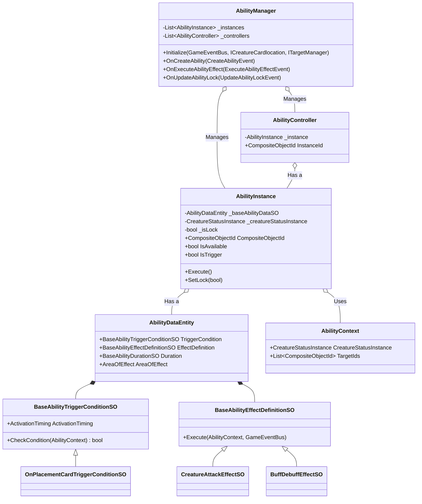
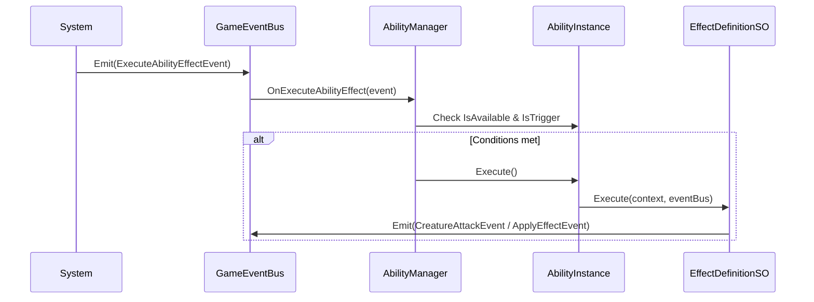
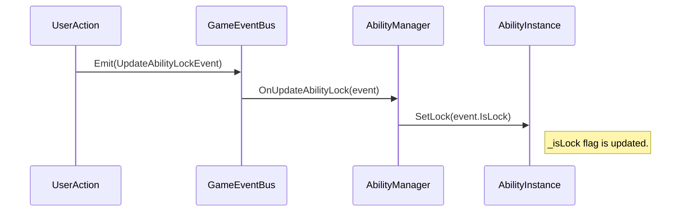

# sys_ability_system.md - アビリティシステム設計書

---

## 概要

本設計は、「Cards and Dices」プロジェクトにおいて、クリーチャーが持つ固有能力（アビリティ）の定義、実行、状態管理を行う「アビリティシステム」の技術的な実装を定義します。本システムは、データ駆動およびイベント駆動の設計原則に基づき、アビリティの多様な発動条件と効果を柔軟かつ拡張可能に管理することを目的とします。

---

## クラスおよびコンポーネント設計

本システムは、アビリティの定義（ScriptableObject）、実行時の状態（Instance）、そしてそれらを統括する管理クラス（Manager）によって構成されます。

### 1. 管理クラス (Manager)

- **`AbilityManager` (ScriptableObject)**:
    - **継承**: `ScriptableObject`, `IDisposable`, `IIdentifiableManager`
    - **責務**:
        - ゲーム内に存在する全ての `AbilityInstance` と `AbilityController` のライフサイクル（生成、破棄）を管理する。
        - `CreateAbilityEvent` を購読し、新しいアビリティのインスタンスとコントローラーを生成する。
        - `ExecuteAbilityEffectEvent` を購読し、発動タイミングに合致する利用可能なアビリティを検索し、実行する。
        - `UpdateAbilityLockEvent` を購読し、特定のアビリティをロックまたはアンロックする。
    - **プロパティ**:
        - `_instances`: 管理下の `AbilityInstance` のリスト。
        - `_controllers`: 管理下の `AbilityController` のリスト。
    - **メソッド**:
        - `Initialize(...)`: DIコンテナから依存性を注入し、イベントの購読を開始する。
        - `OnCreateAbility(CreateAbilityEvent)`: イベントに応じて `AbilityInstance` と `AbilityController` を生成・登録する。
        - `OnExecuteAbilityEffect(ExecuteAbilityEffectEvent)`: 条件に合うアビリティの `Execute` メソッドを呼び出す。
        - `OnUpdateAbilityLock(UpdateAbilityLockEvent)`: 対象アビリティの `SetLock` メソッドを呼び出す。
        - `DisposeByCompositeObjectId(CompositeObjectId)`: 指定されたIDに関連するインスタンスとコントローラーを破棄する。

### 2. 仲介クラス (Presenter / Controller)

- **`AbilityController` (POCO)**:
    - **継承**: `IDisposable`, `IIdentifiableController`
    - **責務**: `AbilityInstance` (Model) と将来的なViewを仲介する。現状はインスタンスを保持するのみで、具体的なロジックは持たない。
    - **プロパティ**:
        - `_instance`: 担当する `AbilityInstance`。
        - `InstanceId`: 担当するインスタンスの `CompositeObjectId`。

### 3. データ定義 (Model - ScriptableObject)

- **`AbilityDataEntity` (ScriptableObject)**:
    - **継承**: `BaseEntityDefinition`
    - **責務**: 一つのアビリティの静的な定義を保持する。発動条件、効果、持続期間の各定義(SO)への参照を持つコンテナとして機能する。
    - **プロパティ**:
        - `TriggerCondition`: アビリティが発動する条件を定義した `BaseAbilityTriggerConditionSO`。
        - `EffectDefinition`: 発動時に実行される効果を定義した `BaseAbilityEffectDefinitionSO`。
        - `Duration`: 使用回数やクールダウンなどの持続期間を管理する `BaseAbilityDurationSO`。
        - `AreaOfEffect`: 効果が及ぶ範囲。

- **`BaseAbilityTriggerConditionSO` (ScriptableObject)**:
    - **継承**: `ScriptableObject` (abstract)
    - **責務**: アビリティが発動するための条件を判定するロジックを定義する。
    - **プロパティ**:
        - `ActivationTiming`: アビリティが評価されるタイミング（例: `OnAttacked`, `OnTurnStart`）。
    - **メソッド**:
        - `CheckCondition(AbilityContext)`: 与えられたコンテキストで条件が満たされるかを判定する。

- **`BaseAbilityEffectDefinitionSO` (ScriptableObject)**:
    - **継承**: `ScriptableObject` (abstract)
    - **責務**: アビリティが実行する具体的な効果を定義する。
    - **メソッド**:
        - `Execute(AbilityContext, GameEventBus)`: 効果を実行する。通常、`GameEventBus` を介して具体的なコマンド（`CreatureAttackEvent`など）を発行する。

### 4. 実行時インスタンス (Model - POCO)

- **`AbilityInstance` (POCO)**:
    - **継承**: `IDisposable`, `IIdentifiableInstance`
    - **責務**:
        - `AbilityDataEntity` の実行時インスタンスとして、特定クリーチャーのアビリティの状態を管理する。
        - アビリティが現在使用可能か (`IsAvailable`)、トリガー条件を満たしているか (`IsTrigger`) を判定する。
        - アビリティのロック状態 (`_isLock`) や残り使用回数 (`_remainingUsages`) を保持する。
    - **プロパティ**:
        - `CompositeObjectId`: このアビリティを所有するクリーチャーのID。
        - `BaseAbilityData`: アビリティの静的定義である `AbilityDataEntity`。
        - `IsAvailable`: アビリティが使用可能か（ロックされておらず、使用回数が残っているか等）。
        - `IsTrigger`: 発動条件を満たしているか。
        - `IsLock`: アビリティがロックされているか。
    - **メソッド**:
        - `Execute()`: アビリティの実行を試みる。`IsTrigger` と `IsAvailable` をチェックし、条件を満たせば `EffectDefinition` を実行する。
        - `SetLock(bool flg)`: アビリティのロック状態を設定する。

- **`AbilityContext` (POCO)**:
    - **責務**: アビリティの条件判定や効果実行に必要な情報を運搬するデータコンテナ。
    - **プロパティ**:
        - `CreatureStatusInstance`: アビリティの実行者のステータス。
        - `TargetIds`: 効果の対象となるオブジェクトIDのリスト。
        - `DiceValue`: （インレットなどで使用された）ダイスの値。
        - `ICreatureCardlocation`: クリーチャーの配置場所を取得するためのインターフェース。

---

## 主要な処理フロー

### 1. アビリティの実行（攻撃、バフ・デバフ）

1.  ゲームの特定のフェーズ（例: ターン開始時、攻撃後）で、システムが `ExecuteAbilityEffectEvent` を発行する。このイベントには、発動タイミング (`TriggerTiming`) と実行者ID (`SourceObjectId`) が含まれる。
2.  `AbilityManager` がこのイベントを購読し、`OnExecuteAbilityEffect` メソッドを実行する。
3.  `AbilityManager` は、管理下の全 `AbilityInstance` の中から、`SourceObjectId` と `TriggerTiming` がイベントと一致するものを検索する。
4.  見つかった各 `AbilityInstance` に対して、`IsAvailable` (ロック中でないか、など) と `IsTrigger` (配置場所が正しいか、など) のプロパティをチェックする。
5.  両方の条件を満たした `AbilityInstance` の `Execute()` メソッドを呼び出す。
6.  `Execute()` メソッド内で、`ITargetManager` を使用して効果範囲 (`AreaOfEffect`) に基づくターゲットリストを取得し、`AbilityContext` に設定する。
7.  `AbilityContext` を引数として、`AbilityDataEntity` に定義された `EffectDefinition` の `Execute()` メソッドを呼び出す。
8.  `CreatureAttackEffectSO` や `BuffDebuffEffectSO` などの具体的な `EffectDefinition` は、`GameEventBus` を通じて `CreatureAttackEvent` や `ApplyEffectEvent` などの最終的なイベントを発行し、他のシステム（`CreatureManager` や `EffectManager`）に実際の状態変化を委任する。

### 2. アビリティのロック

1.  プレイヤーが敵クリーチャーのインレットにダイスを置くなど、アビリティを封じるアクションを行う。
2.  対応するシステム（例: `InletManager`）が `UpdateAbilityLockEvent` を発行する。このイベントには、ロック対象のインレットID (`SubSourceObjectId`) とロック状態 (`IsLock`) が含まれる。
3.  `AbilityManager` がこのイベントを購読し、`OnUpdateAbilityLock` メソッドを実行する。
4.  `AbilityManager` は、管理下の全 `AbilityInstance` の中から、`SubOwnerId` がイベントの `SubSourceObjectId` と一致するものを検索する。
5.  見つかった `AbilityInstance` の `SetLock(bool)` メソッドを呼び出し、`_isLock` フラグを更新する。
6.  以降、この `AbilityInstance` の `IsAvailable` プロパティは、`_isLock` が `true` の間 `false` を返すようになり、アビリティの実行が抑制される。

---

## 関連ファイル

- [gdd_combat_system.md](../gdd/gdd_combat_system.md)
- [guide_design-principles.md](../guide/guide_design-principles.md)
- [sys_domain-model.md](./sys_domain-model.md)

---

## 更新履歴

- 2025-10-13: 初版 (Gemini)
