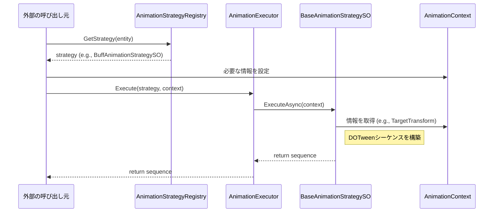

# sys_animation_system.md - アニメーションシステム設計書

---

## 概要

本設計は、「Cards and Dices」プロジェクトにおけるアニメーション再生システムの技術的な実装を定義します。
このシステムは、**ストラテジーパターン**と**ScriptableObject**を全面的に活用することで、アニメーションのロジックとパラメータを分離し、高い再利用性とメンテナンス性を実現することを目的とします。

- **データ駆動設計**: アニメーションの種類や詳細なパラメータ（時間、動きの大きさなど）はすべて`ScriptableObject`として定義され、エンジニア以外の担当者でも調整が可能です。
- **関心の分離**: アニメーションの「実行タイミングを決定する部分」、「具体的な動きを実装する部分（戦略）」、「動きのパラメータを定義する部分」が明確に分離されています。

---

## クラスおよびコンポーネント設計

### 1. 管理・実行クラス

- **`AnimationExecutor`**:
    - **継承**: `Pure C# Class`
    - アニメーション戦略(`BaseAnimationStrategySO`)を受け取り、実行する責務を持つサービスクラスです。
    - **プロパティ**: なし
    - **責務**: 特定のアニメーション戦略を実行し、その結果として生成されたDOTweenの`Sequence`を返却します。
    - **メソッド `Execute(...)`**: `BaseAnimationStrategySO`と`AnimationContext`を引数に取り、戦略の`ExecuteAsync`を呼び出してアニメーションを開始させます。戦略がnullの場合は空のシーケンスを返します。

- **`AnimationStrategyRegistry`**:
    - **継承**: `ScriptableObject`
    - `AnimationStrategyEntity` (ID) と `BaseAnimationStrategySO` (戦略) のマッピングを管理するレジストリです。
    - **プロパティ**: `_strategyMappings` (Inspector設定用), `_registry` (実行時参照用Dictionary)
    - **責務**: `AnimationStrategyEntity`をキーとして、対応するアニメーション戦略(`BaseAnimationStrategySO`)を提供します。
    - **メソッド `GetStrategy(...)`**: `AnimationStrategyEntity`を引数に取り、辞書から対応する`BaseAnimationStrategySO`を検索して返します。

- **`AnimationContext`**:
    - **継承**: `MonoBehaviour`
    - アニメーションの実行に必要なコンテキスト情報（対象オブジェクト、コマンドバスなど）を集約し、各戦略クラスに渡すためのコンテナです。
    - **プロパティ**: `TargetTransform`, `SpriteCommandBus`, `VfxDefinition`, `MultiRendererVisualController`など、アニメーションに必要な各種コンポーネントへの参照を保持します。
    - **責務**: アニメーション戦略が必要とする外部のコンポーネントやデータへのアクセスを提供します。

### 2. 戦略クラス (Strategy)

- **`BaseAnimationStrategySO`**:
    - **継承**: `ScriptableObject` (抽象クラス)
    - 全てのアニメーション戦略クラスが継承する抽象基底クラスです。
    - **プロパティ**: なし
    - **責務**: 全ての戦略クラスに`ExecuteAsync`メソッドの実装を強制します。
    - **メソッド `ExecuteAsync(...)`**: `AnimationContext`を引数に取り、具体的なアニメーションのDOTween `Sequence`を返す抽象メソッドです。

- **`BuffAnimationStrategySO`**:
    - **継承**: `BaseAnimationStrategySO`
    - バフ効果が付与された際のアニメーションを実装する具体的な戦略クラスです。
    - **プロパティ**: `_profile` (`BuffAnimationProfile`への参照)
    - **責務**: `BuffAnimationProfile`に定義されたパラメータに基づき、対象オブジェクトが「つぶれて伸びる」といった具体的なアニメーションシーケンスを構築します。
    - **メソッド `ExecuteAsync(...)`**: `AnimationContext`から対象Transformを取得し、`_profile`のパラメータを使ってDOTweenシーケンスを構築して返します。アニメーション完了後にはVFX再生コマンドを発行します。

- **`DragAnimationStrategySO`**:
    - **継承**: `BaseAnimationStrategySO`
    - ドラッグ操作中のようなアニメーションを実装する具体的な戦略クラスです。
    - **プロパティ**: `_profile` (`DragAnimationProfile`への参照)
    - **責務**: `DragAnimationProfile`に基づき、対象オブジェクトのフェードやスケール変更のアニメーションシーケンスを構築します。
    - **メソッド `ExecuteAsync(...)`**: `AnimationContext`から`MultiRendererVisualController`などを取得し、フェードとスケール変更のDOTweenシーケンスを構築して返します。

### 3. データ定義 (Data)

- **`AnimationStrategyEntity`**:
    - **継承**: `BaseEntityDefinition` -> `ScriptableObject`
    - アニメーション戦略の種類を一意に識別するためのIDとして機能する`ScriptableObject`です。
    - **プロパティ**: `Id` (基底クラスから継承)
    - **責務**: アニメーション戦略の種別を定義し、`AnimationStrategyRegistry`での検索キーとして使用されます。

- **`BaseAnimationProfile`**:
    - **継承**: `ScriptableObject` (抽象クラス)
    - 全てのアニメーションパラメータ定義の基底クラスです。
    - **プロパティ**: `_duration` (アニメーションの基本再生時間)
    - **責務**: 全てのアニメーションプロファイルに共通のプロパティを提供します。

- **`BuffAnimationProfile` / `BodySlamAnimationProfile`**:
    - **継承**: `BaseAnimationProfile`
    - 特定のアニメーション（バフ、体当たりなど）に関する詳細なパラメータを定義するデータクラスです。
    - **プロパティ**: `_squashScale`, `_lungeDistance`など、各アニメーションに固有の調整値を保持します。
    - **責務**: アニメーションの見た目や挙動に関する具体的な数値を定義し、エンジニア以外でも調整可能にします。

---

## 主要な処理フロー

### アニメーションの実行シーケンス

1.  外部の呼び出し元（例: `CardEffect`の処理など）が、特定のアニメーションを実行したいと考えます。
2.  呼び出し元は`AnimationStrategyRegistry`に対し、`AnimationStrategyEntity`（例: "Buff"のID）を渡して`GetStrategy()`を呼び出し、対応する`BaseAnimationStrategySO`（この場合は`BuffAnimationStrategySO`のインスタンス）を取得します。
3.  呼び出し元は、アニメーションに必要な情報を詰めた`AnimationContext`を準備します。
4.  呼び出し元は`AnimationExecutor.Execute()`を呼び出し、取得した戦略（`BuffAnimationStrategySO`）と`AnimationContext`を渡します。
5.  `AnimationExecutor`は、渡された戦略の`ExecuteAsync()`メソッドを実行します。
6.  `BuffAnimationStrategySO`は、`AnimationContext`からターゲットの`Transform`などを取得し、自身の`_profile`（`BuffAnimationProfile`）に定義されたパラメータを基に、DOTweenを使ってアニメーションシーケンスを構築します。
7.  構築された`Sequence`が`AnimationExecutor`を経由して呼び出し元に返却され、再生されます。
8.  （オプション）戦略クラスは、`Sequence.OnComplete()`などを用いて、アニメーション完了時に`SpriteCommandBus`経由でVFX再生コマンドなどを発行することができます。

---

## 既存システムとの連携

- **コマンドバスシステム**: `AnimationContext`が`SpriteCommandBus`の参照を保持しています。これにより、各アニメーション戦略はアニメーションの完了時などに`PlayVfxCommand`のような新しいコマンドを発行でき、VFXシステムなど他のシステムと疎結合に連携します。
- **カード・エフェクトシステム**: このアニメーションシステムは、カード効果の視覚表現として利用されることを想定しています。カード効果を処理するクラスが、このシステムの「外部の呼び出し元(Caller)」として機能します。

---

## 関連ファイル

- [guide_design-principles.md](../../guide/guide_design-principles.md)

---

## 更新履歴

- 2025-09-18: 初版作成 (Gemini)
