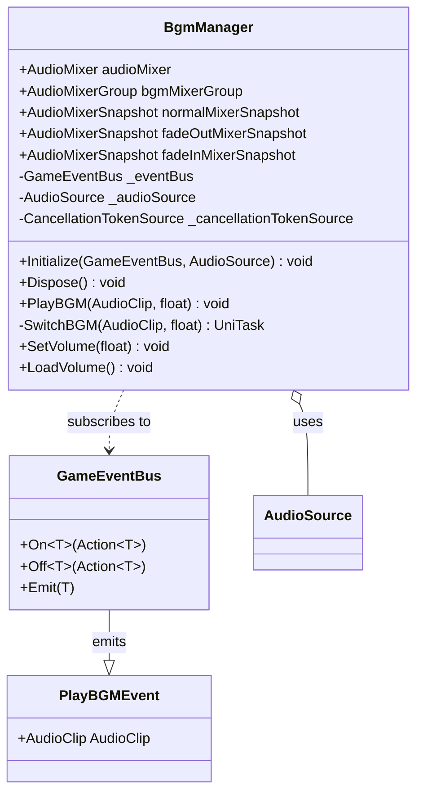

# sys_bgm_system.md - BGM管理システム設計書

---

## 概要

本設計書は、「Cards and Dices」プロジェクトにおけるBGM（背景音楽）の再生、切り替え、および音量管理を行う「BGM管理システム」の技術的な実装を定義します。

本システムは `ScriptableObject` ベースのマネージャーとして実装され、DIコンテナ（VContainer）を通じて依存性を注入されます。BGMのクロスフェードは `AudioMixer` の `Snapshot` 機能を利用して実現します。

**前提条件:** 本システムの動作は、`gdd_unity_specs.md` に定義された `AudioMixer` の設定（Snapshot、Group、公開パラメータ）が正しく行われていることを前提とします。

---

## クラスおよびコンポーネント設計

本システムは、BGMの制御を責務とする単一のマネージャークラスで構成されます。イベントバスを介して再生イベントを受け取り、DIされた `AudioSource` を操作します。

### 1. BGM管理クラス

- **`BgmManager` (ScriptableObject)**:
    - **継承**: `ScriptableObject`, `IDisposable`
    - **プロパティ**:
        - `audioMixer`: BGMの音量やスナップショットを管理する `AudioMixer`。
        - `bgmMixerGroup`: BGMが属する `AudioMixerGroup`。
        - `normalMixerSnapshot`: 通常再生時の `AudioMixerSnapshot`。
        - `fadeOutMixerSnapshot`: フェードアウト用の `AudioMixerSnapshot`。
        - `fadeInMixerSnapshot`: フェードイン用の `AudioMixerSnapshot`。
        - `_eventBus`: イベントの送受信を行う `GameEventBus`。
        - `_audioSource`: BGMの再生を担当する `AudioSource` コンポーネント。
        - `_cancellationTokenSource`: 非同期処理のキャンセルを管理する `CancellationTokenSource`。
    - **責務**:
        - BGMの再生、停止、およびクロスフェード切り替えの管理。
        - `PlayBGMEvent` を購読し、イベントに応じたBGM再生処理の実行。
        - `AudioMixer` のスナップショット機能を利用したスムーズなフェード処理の実現。
        - BGM音量の永続化（`PlayerPrefs`）と読み込み。
        - オブジェクト破棄時にイベント購読の解除と非同期タスクのキャンセルを行う。
    - **メソッド**:
        - `Initialize(GameEventBus eventBus, AudioSource audioSource)`: DIコンテナから依存性を注入し、イベント購読や初期化処理を行う。
        - `Dispose()`: `IDisposable` インターフェースの実装。イベント購読を解除し、`CancellationTokenSource` をキャンセル・破棄する。
        - `PlayBGMStart(PlayBGMEvent evt)`: `PlayBGMEvent` を受信した際のハンドラ。
        - `PlayBGM(AudioClip clip, float fadeDuration)`: BGMの切り替え処理を開始する。
        - `SwitchBGM(AudioClip clip, float fadeDuration)`: `UniTask` を用いた非同期のクロスフェード処理を実行する。
        - `SetVolume(float volume)`: BGMの音量を設定し、`PlayerPrefs` に保存する。
        - `LoadVolume()`: `PlayerPrefs` から音量を読み込み、`AudioMixer` に適用する。

---

## 主要な処理フロー

### 1. BGM切り替えフロー

1.  外部のシステムが、再生したい `AudioClip` をペイロードに含んだ `PlayBGMEvent` を `GameEventBus` に発行する。
2.  `BgmManager` は `Initialize` 時に購読登録した `PlayBGMStart` メソッドでイベントを検知する。
3.  `PlayBGMStart` は `PlayBGM` メソッドを呼び出す。
4.  `PlayBGM` は、非同期メソッド `SwitchBGM` を呼び出し、`UniTask.Forget()` で実行をスケジュールする。
5.  `SwitchBGM` 内で、まず `fadeOutMixerSnapshot` に指定秒数で遷移させ、現在のBGMをフェードアウトさせる。
6.  `UniTask.Delay` を用いてフェードアウトの完了を待つ。
7.  `AudioSource` の `clip` を新しい `AudioClip` に差し替え、`Play()` を呼び出す。
8.  最後に `fadeInMixerSnapshot` に指定秒数で遷移させ、新しいBGMをフェードインさせる。
9.  `Dispose` が呼ばれると `CancellationToken` がキャンセルされ、`UniTask.Delay` が中断されることで、安全に非同期処理が停止する。

### 2. 音量設定フロー

1.  UIのスライダー操作などにより、外部から `SetVolume(float volume)` が呼び出される。
2.  `SetVolume` は、受け取ったリニア値 `volume`（0.0〜1.0）を対数スケールのデシベル（dB）値に変換する。
3.  `AudioMixer.SetFloat()` を使用し、公開パラメータ "BGMvolume" に変換後のdB値を設定する。
4.  `PlayerPrefs.SetFloat()` を使用し、リニア値 `volume` を "BGMvolume" のキーでデバイスに保存する。
5.  アプリケーション起動時、`Initialize` から呼ばれる `LoadVolume` が `PlayerPrefs` から値を読み込み、`SetVolume` を通じて `AudioMixer` に適用することで、前回の音量を復元する。

---

## 関連ファイル

- [guide_design-principles.md](../guide/guide_design-principles.md)
- [gdd_unity_specs.md](../gdd/gdd_unity_specs.md)

---

## 更新履歴

- 2025-11-09: 初版 (Gemini)
