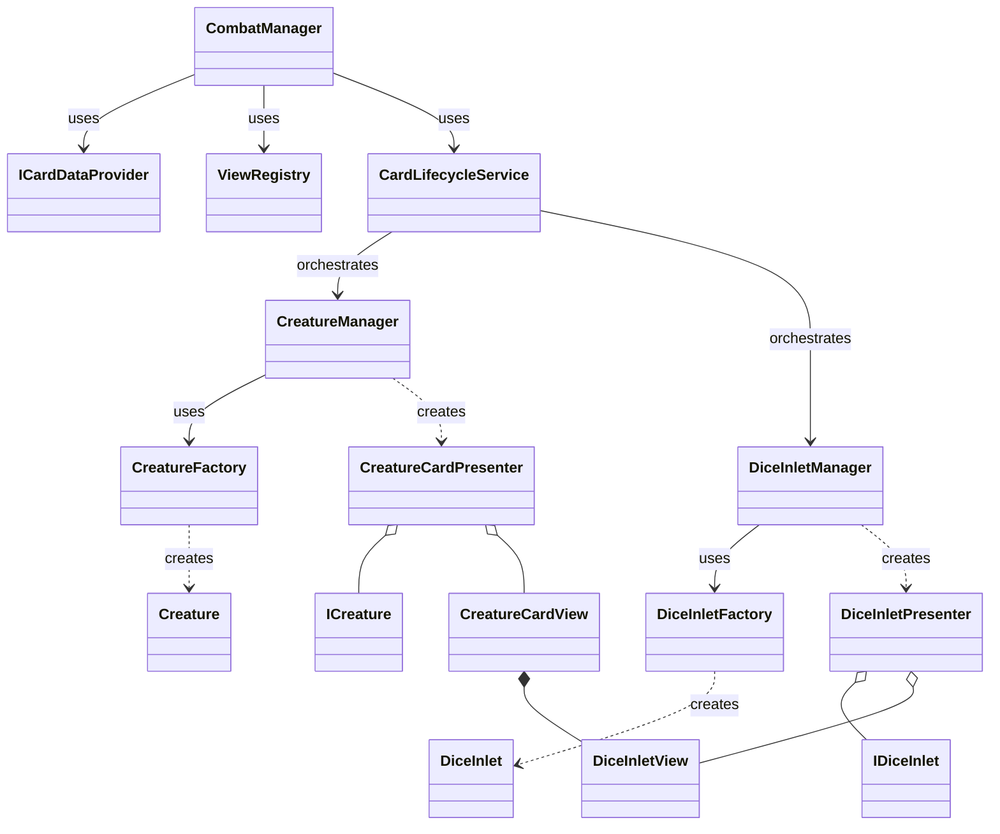

<!-- markdownlint-disable MD024 -->
# sys_creature_card_lifecycle_design.md - クリーチャーカードのライフサイクル設計書

---

## 概要

このドキュメントは、クリーチャーカードの生成から除去までのライフサイクル全体を定義します。
このプロセスは、`CardLifecycleService` を中心に、`CreatureManager`、`DiceInletManager`、`ViewRegistry` などの複数のサービスやマネージャーが連携して実現されます。`CardLifecycleService` は、カードの論理的な側面（クリーチャー、能力）と視覚的な側面（View）のセットアップとティアダウンを統括する役割を担います。

---

## 主要コンポーネントとクラス図

### 1. 各コンポーネントの役割

| コンポーネント | 役割 |
| :--- | :--- |
| **`CombatManager`** | 戦闘全体の流れを制御する司令塔。カード生成のトリガーとなり、`ICardDataProvider` から初期化データを取得し、`CardLifecycleService` にカードの初期化を依頼します。 |
| **`ICardDataProvider`** | プレイヤーやエネミーのデータソースに基づき、カードの初期化情報(`CardInitializationData`)を生成する責務を負います。 |
| **`CardInitializationData`** | カード生成に必要な情報（`CreatureData`、`InletAbilityProfile`リスト）を集約したデータ転送オブジェクト(DTO)。 |
| **`ViewRegistry`** | シーン上のViewコンポーネントを管理するレジストリ。オブジェクトプールとして機能し、利用可能な `CreatureCardView` を提供します。 |
| **`CardLifecycleService`** | **本システムの中心。** `CreatureManager` と `DiceInletManager` を調整し、カードの論理部分とView部分の生成・初期化・破棄を統括します。 |
| **`CreatureManager`** | `ICreature` インスタンス（クリーチャーの論理部分）と、それをViewに接続する `CreatureCardPresenter` の生成と管理を担当します。 |
| **`DiceInletManager`** | `IDiceInlet` インスタンス（インレットの論理部分）と、それをViewに接続する `DiceInletPresenter` の生成と管理を担当します。 |
| **`CreatureCardView`** | クリーチャーカードの視覚表現を担当するコンポーネント。自身に紐づく`DiceInletView`のリストを保持します。 |

### 2. クラス図 (Mermaid)

---

## カード生成・初期化フロー

クリーチャーカードは、戦闘開始時や新たなウェーブの発生時に `CombatManager` を起点として生成されます。

### 1. シーケンス

1.  **`CombatManager`**: `ICardDataProvider` (例: `PlayerCardDataProvider`) を使用して、生成すべきカードの `CardInitializationData` のリストを取得します。
2.  **`CombatManager`**: ループ処理で、リスト内の各 `CardInitializationData` に対して以下の処理を実行します。
3.  **`CombatManager`**: `ViewRegistry.GetNextAvailableCreatureCardView()` を呼び出し、オブジェクトプールから利用可能な `CreatureCardView` インスタンスを取得します。この時点で、Viewの `IsSpawned` フラグは `true` に設定されます。
4.  **`CombatManager`**: 取得した `cardView` と `initData` を引数に、`CardLifecycleService.InitializeCard()` を呼び出します。
5.  **`CardLifecycleService`**: `InitializeCard` メソッド内部で、以下の処理を統括します。
    1.  `_creatureManager.SpawnCreature(initData.CreatureData, cardView)` を呼び出します。
        -   **`CreatureManager`** は `CreatureFactory` を使って `ICreature` (Model) を生成し、さらに `CreatureCardPresenter` を生成してModelと`cardView`(View)を接続します。
    2.  `cardView.GetInletViews()` でインレットのViewリストを取得します。
    3.  `initData.InletAbilityProfiles` とインレットViewをペアにしてループ処理します。
    4.  ループ内で `_diceInletManager.CreateAndRegisterInlet(inletView, cardView.GetObjectId(), profile)` を呼び出します。
        -   **`DiceInletManager`** は `DiceInletFactory` を使って `IDiceInlet` (Model) を生成し、さらに `DiceInletPresenter` を生成してModelと`inletView`(View)を接続します。
6.  **`CombatManager`**: 初期化が完了したカードを `CardSlotManager` を使って盤面に配置します。

---

## カード除去フロー

クリーチャーが倒されるなど、盤面からカードが取り除かれる際のフローです。この処理は、カードの論理部分（クリーチャー、インレット）を破棄し、関連するPresenterの購読を解除します。

### 1. シーケンス

1.  **Trigger** (例: `CombatManager`): カードの除去を判断し、対象の `CreatureCardView` を引数に `CardLifecycleService.TeardownCard()` を呼び出します。
2.  **`CardLifecycleService`**: `TeardownCard` メソッド内部で、以下の処理を統括します。
    1.  `_creatureManager.RemoveCreature(cardView.GetObjectId())` を呼び出します。
        -   **`CreatureManager`** は、管理下の `ICreature` インスタンスを削除し、関連する `CreatureCardPresenter` の `Dispose()` メソッドを呼び出してイベント購読を解除します。
    2.  `cardView.GetInletViews()` でインレットのViewリストを取得し、ループ処理します。
    3.  ループ内で `_diceInletManager.RemoveDiceInlet(inletView.GetObjectId())` を呼び出します。
        -   **`DiceInletManager`** は、管理下の `IDiceInlet` インスタンスを削除し、関連する `DiceInletPresenter` の `Dispose()` メソッドを呼び出します。
3.  **Viewのプール返却**: `TeardownCard` の呼び出し元（例: `CombatManager`）が、`cardView.SetDisplayActive(false)` や `cardView.SetSpawnedState(false)` を呼び出し、Viewを非表示にしてオブジェクトプールで再利用可能な状態に戻します。

---

## 関連ファイル

-   [./sys_creature_management.md](./sys_creature_management.md)
-   [./sys_dice_inlet_management.md](./sys_dice_inlet_management.md)
-   [../gdd/gdd_combat_system.md](../gdd/gdd_combat_system.md)

---

## 更新履歴

-   2025-08-17: ソースコードの現状に合わせて、全体のフローを更新し、クラス図を追加 (AI Document Specialist)
-   2025-08-15: シーケンス図をテキストベースの記述に修正 (Gemini)
-   2025-08-15: ソースコードとの同期。シーケンス図の正確性を向上させ、各コンポーネントの役割を明確化。 (Gemini)
-   2025-08-15: 初版 (Gemini)