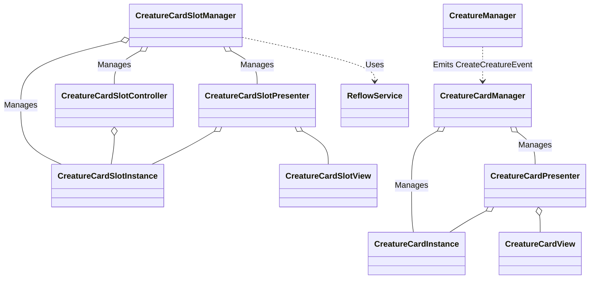

# sys_creature_card_management.md - クリーチャーカード管理設計書

---

## 概要

本設計は、「Cards and Dices」プロジェクトにおける「クリーチャーカード」および「カードスロット」機能の技術的な実装を定義します。カードの生成、状態管理、スロットへの配置、そしてユーザーによるドラッグ＆ドロップ操作とそれに伴うリフロー（再配置）処理まで、カードに関連する全てのコンポーネントとその責務、処理フローを詳述します。

---

## クラスおよびコンポーネント設計

本システムは、MVC (Model-View-Controller) パターンとイベント駆動アーキテクチャに基づき、以下のクラス群で構成されます。

### 1. ランタイムインスタンス (Model)

- **`CreatureCardInstance`**:
    - **継承**: `Pure C# Class`, `IIdentifiableInstance`
    - ゲーム内に存在するクリーチャーカード1枚の実行時データを保持します。
    - **プロパティ**: `CompositeObjectId`, `IsOnScreen`, `IsAlive`.
    - **責務**: カード自身の状態（ID、画面上に存在するか等）を管理します。

- **`CreatureCardSlotInstance`**:
    - **継承**: `Pure C# Class`, `IIdentifiableInstance`
    - カードスロット1個の実行時データを保持します。
    - **プロパティ**: `CompositeObjectId`, `Team`, `LinePosition`, `Location`, `PlacedCardId`, `ReflowPlacedCardId`, `IsOccupied`.
    - **責務**: スロット自身の状態（場所、どのカードが配置されているか、リフロー計算中の一時的な配置カードは何か）を管理します。
    - **メソッド**: `PlacedCard`, `ReflowPlacedCard`, `RemoveCard`.

### 2. 仲介クラス (Presenter / Controller)

- **`CreatureCardPresenter`**:
    - **継承**: `Pure C# Class`, `IIdentifiablePresenter`
    - `CreatureCardInstance` (Model) と `CreatureCardView` (View) を1対1で紐付けます。
    - **責務**: `GameEventBus` を介してイベントを購読し、カードの表示/非表示や、ドラッグ開始時の他カードの非活性化など、ModelとViewの状態を同期させます。

- **`CreatureCardSlotPresenter`**:
    - **継承**: `Pure C# Class`, `IIdentifiablePresenter`
    - `CreatureCardSlotInstance` (Model) と `CreatureCardSlotView` (View) を1対1で紐付けます。
    - **責務**: ドラッグ操作が開始された際に、自身がドロップ対象となりうるかを判断し、Viewの見た目を「受け入れ可能」状態に変更するよう指示します。

- **`CreatureCardSlotController`**:
    - **継承**: `Pure C# Class`, `IIdentifiableController`
    - `CreatureCardSlotInstance` の状態変更を管理します。
    - **責務**: カードの配置、リフロー、削除に関するイベントを購読し、担当する `CreatureCardSlotInstance` の状態を更新します。また、リフロー計算の結果に基づき、カードを移動させるためのアニメーションイベントを発行します。

### 3. 管理クラス (Manager)

- **`CreatureManager`**:
    - **継承**: `ScriptableObject`
    - 戦闘開始時のプレイヤーカード生成フローの起点となります。
    - **責務**: `CombatPhasePlayerCardinitializedEvent` をトリガーに、`ICardDataProvider` からカード情報を取得し、`CreateCreatureEvent` を発行して `CreatureCardManager` にカード生成を依頼します。

- **`CreatureCardManager`**:
    - **継承**: `ScriptableObject`
    - 全ての `CreatureCardInstance` と `CreatureCardPresenter` のライフサイクルを一元管理します。
    - **責務**: `CreateCreatureEvent` を受信し、`CreatureCardInstance` と `CreatureCardPresenter` を生成・紐付けします。

- **`CreatureCardSlotManager`**:
    - **継承**: `ScriptableObject`
    - 全てのカードスロット（`Instance`, `Controller`, `Presenter`）のライフサイクルを一元管理します。
    - **責務**: シーンロード時にスロット群を生成します。カードの配置ロジック（空き手札スロット検索など）の起点となり、ドラッグ中のリフロー計算やドロップ後の前詰め処理を `ReflowService` に依頼します。

### 4. サービスクラス

- **`ReflowService`**:
    - **継承**: `Pure C# Class`
    - カードの再配置（リフロー）計算ロジックに特化したステートレスなサービスクラスです。
    - **責務**: 現在のスロット配置状況とユーザーの操作（ドラッグ元のスロット、ドロップ先のスロット）に基づき、「どのカードがどこへ移動すべきか」という移動計画を計算します。隣接スワップ、押し出し、前詰めなど、複雑なリフローパターンを処理します。

### 5. 表示クラス (ビュー)

- **`CreatureCardView`**:
    - **継承**: `BaseIdentifiableView`
    - クリーチャーカードの視覚的表現を担当します。Presenterからの指示でアニメーションなどを実行します。

- **`CreatureCardSlotView`**:
    - **継承**: `BaseIdentifiableView`
    - カードスロットの視覚的表現を担当します。Presenterからの指示で「受け入れ可能」状態のエフェクトなどを表示します。

---

## 主要な処理フロー

### 1. クリーチャーカードの生成（ターン開始時）

1.  `SceneInitializer` が `CombatPhasePlayerCardinitializedEvent` を発行します。
2.  `CreatureManager` がこのイベントを受信し、`ICardDataProvider` からプレイヤーが持つべきカードのデータ (`CardInitializationData`) リストを取得します。
3.  `CreatureManager` はリストの各データに対して、`IdentifiableViewRegistry` から未使用の `CreatureCardView` を取得し、`CreateCreatureEvent` を発行します。
4.  `CreatureCardManager` が `CreateCreatureEvent` を受信し、`CreatureCardInstance` と `CreatureCardPresenter` を生成して両者を紐付けます。
5.  一連の生成後、`CreatureManager` は `CombatPhasePlayerCardOnScreenEvent` を発行します。
6.  `CreatureManager` 自身がこれを受信し、生成した各カードに対して `PlacedHandSlotEvent` を発行します。
7.  `CreatureCardSlotManager` が `PlacedHandSlotEvent` を受信し、`GetFirstEmptyHandSlotId()` で空いている手札スロットを探し、そのスロットにカードを論理的に配置（`PlacedCard`を更新）します。
8.  `CreatureManager` が各カードの `DisplayOnScreenEvent` を発行し、`CreatureCardPresenter` がViewを初期位置（手札スロットの座標）へ移動させるアニメーションを実行します。

### 2. クリーチャーカードの配置（ドラッグ＆ドロップ）

1.  **ドラッグ開始**: ユーザーが `CreatureCardView` をドラッグすると、`IdentifiableInputHandler` が `IdentifiableStateBeginDragEvent` を発行します。これに反応し、`CreatureCardSlotPresenter` はドロップ可能なスロットの見た目を「受け入れ可能」状態に変更します。
2.  **リフロー計算 (プレビュー)**: ドラッグ中のカードが別のスロット上にホバーすると、`IdentifiableStateDragedHoverEvent` が発行されます。`CreatureCardSlotManager` はこれを受け、`ReflowService.CalculateReflowMovements` を呼び出します。`ReflowService` は、カードの入れ替えや押し出しを計算し、各スロットの `ReflowPlacedCardId`（リフロー計算中の一時的な配置ID）を更新します。`CreatureCardSlotManager` は計算結果に基づき、各カードをプレビュー位置へ移動させるイベントを発行します。
3.  **ドロップ処理**: ユーザーがスロット上でカードをドロップすると、`IdentifiableStateDropEvent` が発行されます。
4.  **配置確定と前詰め**: `CreatureCardSlotManager` はドロップイベントを受け、再度 `ReflowService` を呼び出して最終的な配置を計算します。その後、`ReflowService.CalculateFrontLoadMovements` を呼び出して、空いたスロットを埋めるための「前詰め」処理を実行します。
5.  **状態の確定**: 最後に `ResetUIStatusEvent` が発行され、各 `CreatureCardSlotController` は `ReflowPlacedCardId` の内容を永続的な `PlacedCardId` に確定させ、一連の配置処理が完了します。

---

## 既存システムとの連携

- **Identifiable View システム**: 全てのカードとスロットは `IIdentifiableView` を実装し、`CompositeObjectId` によって一意に識別されます。ユーザー入力は `IdentifiableInputHandler` によって検知され、`IdentifiableState...Event` 群に変換されます。
- **イベントバスシステム**: 本システムの全コンポーネントは `GameEventBus` を介して疎結合に連携します。状態の変更や処理の依頼は、コンポーネント間の直接参照ではなく、イベントの発行・購読によって行われます。
- **DIコンテナ (VContainer)**: `Manager` クラスや `Service` クラスはDIコンテナによって依存性が注入され、コンポーネント間の結合度を低く保っています。

---

## 関連ファイル

- [gdd_combat_system.md](../../gdd/gdd_combat_system.md)
- [sys_identifiable-views.md](../sys/sys_identifiable-views.md)

---

## 更新履歴

- 2025-09-22: 初版 (Gemini)
