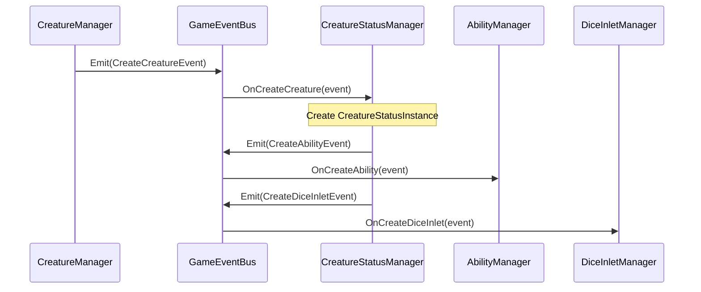
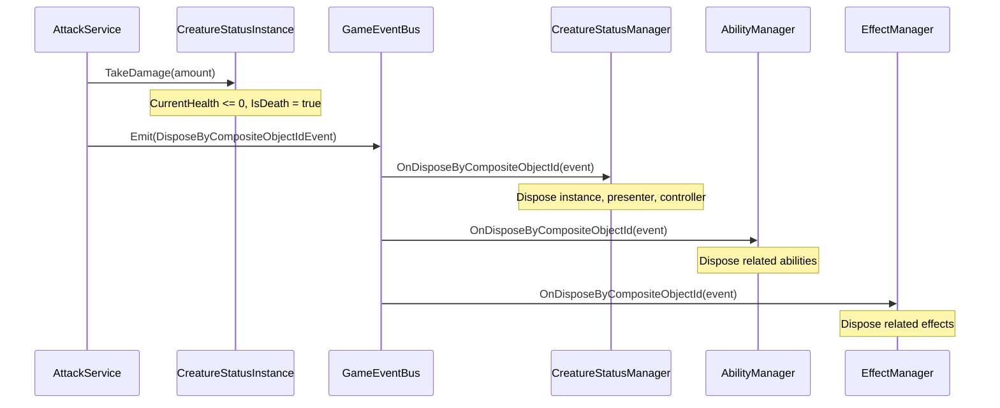

# sys_creature_status_management.md - クリーチャーステータス管理設計書

---

## 概要

本設計は、「Cards and Dices」プロジェクトにおいて、戦闘に参加する各クリーチャーの動的な状態（ステータス）を管理する「クリーチャーステータス管理システム」の技術的な実装を定義します。

本システムは、プロジェクトの基本原則である「関心の分離」「データ駆動」「イベント駆動」に厳密に従います。中央管理クラスである `CreatureStatusManager` が、クリーチャーの生成から破棄までのライフサイクルを一元管理します。クリーチャーのステータスは、純粋なデータクラスである `CreatureStatusInstance` によって保持され、その値は `IEffectValue` インターフェースを通じてバフ・デバフ効果を動的に反映して計算されます。

---

## クラスおよびコンポーネント設計

本システムは、ステータスの定義（Data）、実行時の状態（Model）、それらを統括する管理クラス（Manager）、そして状態を表示するUI（View）とそれらを繋ぐ仲介クラス（Presenter/Controller）によって構成されます。

```mermaid
classDiagram
    direction LR
    class GameEventBus {
        <<ScriptableObject>>
        +Emit(event)
    }
    class IEffectValue {
        <<interface>>
        +GetTotalEffectValue(id, type) int
    }
    class ICreatureStatusInstanceRepository {
        <<interface>>
        +GetInstance(id) CreatureStatusInstance
        +GetInstanceList() List~CreatureStatusInstance~
    }
    class CreatureStatusManager {
        <<ScriptableObject>>
        -List~CreatureStatusInstance~ _instances
        +OnCreateCreature(event)
        +DisposeByCompositeObjectId(id)
    }
    class CreatureStatusInstance {
        <<Model>>
        +CompositeObjectId
        +int CurrentHealth
        +int Attack
        +bool IsDeath
        +TakeDamage(amount)
    }
    class CreatureStatusPresenter {
        <<Presenter>>
        -CreatureStatusInstance _instance
        -CreatureStatusView _view
    }
    class CreatureStatusView {
        <<View>>
        +DisplayDeath()
        +DisplayDamage()
    }
    class CreatureManager {
        <<ScriptableObject>>
        +OnCombatPhasePlayerCardinitialized()
    }
    class FixedCardInitializer {
        <<ScriptableObject>>
        +CreateCardInitializationData() CardInitializationData
    }
    class CardInitializationData {
        <<DTO>>
        +CreatureData
    }
    class CreatureData {
        <<Data>>
        +int Attack
        +int Health
    }


    CreatureStatusManager ..|> ICreatureStatusInstanceRepository
    CreatureStatusManager o-- CreatureStatusInstance : creates & manages
    CreatureStatusManager o-- CreatureStatusPresenter : creates & manages
    CreatureStatusPresenter o-- CreatureStatusInstance : has a
    CreatureStatusPresenter o-- CreatureStatusView : has a
    CreatureStatusInstance ..> IEffectValue : uses
    CreatureManager --> GameEventBus : emits CreateCreatureEvent
    GameEventBus --> CreatureStatusManager : OnCreateCreature
    FixedCardInitializer --> CardInitializationData : creates
    CardInitializationData o-- CreatureData : contains
```

### 1. データ定義 (ScriptableObject / POCO)

- **`CreatureData` (POCO)**:
    - **責務**: クリーチャーの不変な基本データを定義します。`FixedCardInitializer` によって生成され、`CardInitializationData` に内包されます。
    - **プロパティ**: `CreatureId`, `Attack`, `Health`, `Shield`, `Cooldown`, `Energy`, `Abilities`, `MainAttackScoresType` など。

- **`FixedCardInitializer` (ScriptableObject)**:
    - **責務**: Inspectorで設定された固定値から `CardInitializationData` を生成するファクトリクラス。主にエネミーや固定召喚ユニットの定義に使用されます。
    - **メソッド**: `CreateCardInitializationData()`: `CreatureData` や `InletPackageProfile` を内包した `CardInitializationData` を生成します。

- **`CardInitializationData` (POCO / DTO)**:
    - **責務**: クリーチャー生成に必要な全ての情報を集約するデータ転送オブジェクト。`CreatureManager` から `CreatureStatusManager` へ、生成要求と共に渡されます。
    - **プロパティ**: `CreatureData`, `InletPackageProfiles`, `Appearance`, `CreatureDataTeam`。

### 2. 実行時インスタンス (Model)

- **`CreatureStatusInstance` (POCO)**:
    - **継承**: `IDisposable`, `IIdentifiableInstance`
    - **責務**:
        - 戦闘中のクリーチャー1体の動的な状態（現在HP、シールド、クールダウン等）を保持します。
        - `IEffectValue` を通じてバフ・デバフを動的に反映したステータス（`Attack`, `BaseHealth` など）を算出します。
        - ダメージ計算 (`TakeDamage`) と死亡判定 (`IsDeath`) を行います。
    - **プロパティ**: `CompositeObjectId`, `CurrentHealth`, `CurrentShield`, `IsDeath`, `Attack` (算出プロパティ), `BaseHealth` (算出プロパティ) など。
    - **メソッド**: `TakeDamage(int amount)`, `ChangeCurrentValue(...)`, `ResetCoolDownStatus()`。

### 3. 管理クラス (Manager)

- **`CreatureManager` (ScriptableObject)**:
    - **責務**: 戦闘開始時のカード生成フローの起点。`ICardDataProvider` から初期手札データを取得し、カード枚数分の `CreateCreatureEvent` を発行します。
    - **メソッド**: `OnCombatPhasePlayerCardinitialized(...)`: 戦闘初期化イベントを受けて処理を開始します。

- **`CreatureStatusManager` (ScriptableObject)**:
    - **継承**: `ScriptableObject`, `IDisposable`, `ICreatureStatusInstanceRepository`, `IIdentifiableManager`
    - **責務**:
        - 全ての `CreatureStatusInstance` のライフサイクル（生成、管理、破棄）を担う中央管理クラス。
        - `CreateCreatureEvent` を購読し、`CreatureStatusInstance` とその Presenter/Controller を生成・初期化します。
        - `DisposeByCompositeObjectIdEvent` を購読し、死亡したクリーチャーのインスタンスと関連コンポーネントを破棄します。
        - `ICreatureStatusInstanceRepository` を実装し、他のシステム（例: `CreatureTurnEndExecuteAbilityService`）にインスタンスへのアクセスを提供します。
    - **メソッド**: `OnCreateCreature(...)`, `DisposeByCompositeObjectId(...)`, `GetInstance(...)`, `GetInstanceList()`。

### 4. サービス / 仲介クラス

- **`CreatureTurnEndExecuteAbilityService` (POCO)**:
    - **責務**: ターン終了時のアビリティ実行という特定のビジネスロジックを担当します。`ICreatureStatusInstanceRepository` を介してクリーチャーの状態を取得し、条件に合うアビリティの実行イベントを発行します。

- **`CreatureStatusPresenter` (POCO)**:
    - **責務**: `CreatureStatusInstance` (Model) と `CreatureStatusView` (View) を1対1で仲介します。Modelの状態変化（例: ダメージ、死亡）をイベントバス経由で受け取り、Viewの表示（アニメーション再生など）を更新するよう指示します。

### 5. 表示クラス (ビュー)

- **`CreatureStatusView` (MonoBehaviour)**:
    - **継承**: `BaseIdentifiableView`
    - **責務**: クリーチャーのステータスに関連する視覚表現を担当します。Presenterからの指示に基づき、ダメージや死亡アニメーションを再生します。

---

## 主要な処理フロー

### 1. クリーチャーの生成とステータス初期化

1.  `CreatureManager` が戦闘開始イベントを受け、`ICardDataProvider` から `CardInitializationData` のリストを取得します。
2.  `CreatureManager` は `CardInitializationData` ごとに `CreateCreatureEvent` を `GameEventBus` に発行します。
3.  `CreatureStatusManager` が `OnCreateCreature` でイベントを購読します。
4.  `CreatureStatusManager` は、イベントのデータを用いて `CreatureStatusInstance` を生成し、管理下のリストに追加します。この際、DIコンテナから注入された `IEffectValue` (`EffectManager`) への参照を渡します。
5.  続けて、`CreatureStatusPresenter` と `CreatureCardStatusIconController` を生成し、InstanceとViewを紐付けます。
6.  さらに、`CreateAbilityEvent` と `CreateDiceInletEvent` を発行し、`AbilityManager` と `DiceInletManager` に、このクリーチャーに属するアビリティとインレットの生成を依頼します。これにより、各システムが連携してクリーチャーの完全なインスタンスが構築されます。

### 2. クリーチャーの死亡とステータスの廃棄

1.  攻撃処理の結果、`CreatureStatusInstance` の `TakeDamage()` メソッドが呼ばれ、`CurrentHealth` が0以下になります。
2.  `TakeDamage()` メソッド内で `IsDeath` フラグが `true` に設定されます。
3.  攻撃処理を管轄するシステム（例: `CreatureAttackService`）は、`IsDeath` フラグを検知し、`DisposeByCompositeObjectIdEvent` を `GameEventBus` に発行します。このイベントには、死亡したクリーチャーの `CompositeObjectId` が含まれます。
4.  `CreatureStatusManager`, `AbilityManager`, `EffectManager` など、`IIdentifiableManager` を実装する複数のマネージャークラスがこのイベントを購読しています。
5.  `CreatureStatusManager` は `DisposeByCompositeObjectId` メソッドを実行し、管理リストから該当する `CreatureStatusInstance`, `CreatureStatusPresenter`, `CreatureCardStatusIconController` を探し出し、それぞれ `Dispose()` を呼び出してリストから削除します。
6.  同様に、`AbilityManager` は関連する `AbilityInstance` を、`EffectManager` は関連する `EffectInstance` を破棄します。これにより、死亡したクリーチャーに関連する全てのランタイムデータがシステムからクリーンアップされます。

---

## 既存システムとの連携

- **エフェクトシステム (`EffectManager`)**:
    - `CreatureStatusInstance` は、ステータス計算時に `IEffectValue` インターフェース（`EffectManager`が実装）をコールします。これにより、`CreatureStatusManager` はエフェクトの具体的な実装を知ることなく、常に最新のバフ・デバフが適用されたステータス値を取得できます。

- **アビリティシステム (`AbilityManager`)**:
    - `CreatureStatusManager` は、クリーチャー生成時に `CreateAbilityEvent` を発行することで、アビリティの生成を `AbilityManager` に委譲します。また、クリーチャー死亡時には `DisposeByCompositeObjectIdEvent` を通じて関連アビリティの破棄を通知します。

- **イベントバスシステム (`GameEventBus`)**:
    - 本システムの全てのコンポーネントは、`GameEventBus` を介して疎結合に連携します。クリーチャーの生成、破棄、状態変化など、主要なライフサイクルイベントは全てイベントバスを通じて伝達されます。

---

## 関連ファイル

- [sys_effect_system.md](./sys_effect_system.md)
- [sys_ability_system.md](./sys_ability_system.md)
- [gdd_combat_system.md](../gdd/gdd_combat_system.md)
- [guide_design-principles.md](../guide/guide_design-principles.md)

---

## 更新履歴

- 2025-10-24: 初版 (Gemini)
