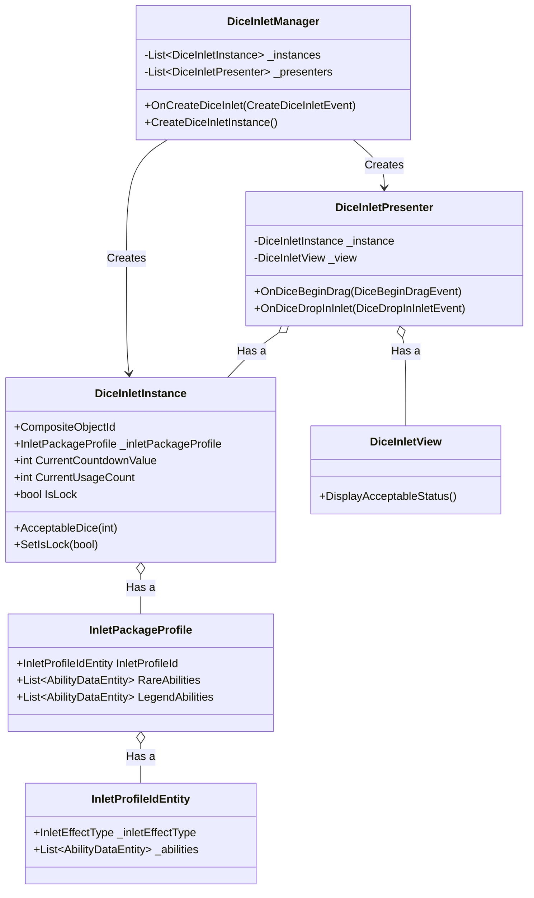

# sys_dice_inlet_management.md - ダイスインレット管理設計書

---

## 概要

本設計は、「Cards and Dices」プロジェクトにおけるクリーチャーカードに付属する「ダイスインレット」機能の技術的な実装を定義します。インレットの生成、状態管理、ユーザーによるダイスの投入、そしてその結果としてのアビリティ実行またはロックに至るまで、インレットに関連する全てのコンポーネントとその責務、処理フローを詳述します。

---

## クラスおよびコンポーネント設計

ダイスインレット管理システムは、MVC (Model-View-Controller) パターンに基づき、以下のクラス群で構成されます。

### 1. データ定義 (ScriptableObject / Pure C# Class)

- **`InletProfileIdEntity`**:
    - **継承**: `ScriptableObject`
    - インレットの不変な基本定義データを保持します。
    - **プロパティ**:
        - `InletActivationViewType`: インレットの見た目の種類。
        - `AllowedDiceFacesEntity`: 受け入れ可能なダイスの目。
        - `InitialCountdownValue`: 能力発動までに必要なカウントの初期値。
        - `InitialUsageCount`: 使用可能回数の初期値。
        - `UsageCountResetType`: 使用回数がリセットされるタイミング。
        - `InletEffectType`: 発動時の効果（アビリティ実行か、敵アビリティのロックか）。
        - `Abilities`: このインレットに紐づく基本アビリティのリスト。
    - **責務**: 個々のインレットが「どのような」特性を持つかを定義する設計図として機能します。

- **`InletPackageProfile`**:
    - **継承**: `Pure C# Class`
    - `InletProfileIdEntity` に加え、レアリティごとの追加アビリティ情報などをパッケージ化したデータコンテナ。
    - **プロパティ**:
        - `InletProfileId`: インレットの基本定義。
        - `InletCategory`: インレットの配置場所（例: `InletTop`, `InletBottom`）。
        - `RareAbilities`: レアアビリティのリスト。
        - `LegendAbilities`: レジェンドアビリティのリスト。
    - **責務**: `CardInitializationData` の一部として、クリーチャー生成時にインレットの全構成情報を `DiceInletManager` に提供します。

### 2. ランタイムインスタンス (Model)

- **`DiceInletInstance`**:
    - **継承**: `Pure C# Class`, `IIdentifiableInstance`
    - ゲーム中に存在するインレット1つずつの実行時インスタンス。
    - **プロパティ**:
        - `CompositeObjectId`: Viewと紐づく一意なID。
        - `CurrentCountdownValue`: 発動までの残りカウント。
        - `CurrentUsageCount`: 残り使用可能回数。
        - `IsLock`: 敵の能力をロックしたかどうかを示す状態。
        - `IsAlive`: インスタンスが有効かどうかの状態。
    - **責務**: インレット自身の揮発的な状態（残りカウント、使用回数、ロック状態）を保持・管理します。
    - **メソッド**:
        - `ChkFaceAllowed(int faceValue)`: 指定された出目のダイスを受け入れ可能か判定します。
        - `AcceptableDice(int faceValue)`: ダイスを受け入れ、カウントダウンを減らします。カウントが0以下になれば `true` を返します。
        - `SetIsLock(bool flg)`: ロック状態を設定します。

### 3. 仲介クラス (Presenter)

- **`DiceInletPresenter`**:
    - **継承**: `Pure C# Class`, `IIdentifiablePresenter`
    - `DiceInletInstance` (Model) と `DiceInletView` (View) を1対1で繋ぐ仲介役。
    - **責務**:
        - `GameEventBus` を購読し、ダイスのドラッグ開始やドロップイベントを監視します。
        - ダイスドラッグ時には、`Instance` の状態に基づき、受け入れ可能であれば `View` の見た目を変更させます。
        - ダイスドロップ時には、`Instance` の状態を更新し、その結果（アビリティ実行/ロック）に応じて後続のイベントを発行します。
    - **メソッド**:
        - `OnDiceBeginDrag(...)`: ダイスのドラッグが開始された際の処理。受け入れ可能ならViewをハイライトさせる。
        - `OnDiceDropInInlet(...)`: 自身のViewにダイスがドロップされた際の処理。`Instance` のカウントを更新し、結果に応じて `ExecuteAbilityEffectEvent` または `UpdateAbilityLockEvent` を発行する。

### 4. 管理クラス (Manager)

- **`DiceInletManager`**:
    - **継承**: `ScriptableObject`, `IIdentifiableManager`
    - 全ての `DiceInletInstance` と `DiceInletPresenter` のライフサイクルを一元管理するマネージャークラス。
    - **責務**:
        - `CreateDiceInletEvent` を購読し、インレットの生成フローを開始します。
        - `DiceInletInstance` と `DiceInletPresenter` を生成し、リストに登録・解除します。
        - インレット生成時に、`InletPackageProfile` に含まれる全てのアビリティ（基本、レア、レジェンド）を生成するための `CreateAbilityEvent` を発行します。

### 5. 表示クラス (View)

- **`DiceInletView`**:
    - **継承**: `BaseIdentifiableView`
    - インレットの視覚的な表現を担当する `MonoBehaviour` クラス。
    - **責務**:
        - `DiceInletPresenter` からの指示に基づき、アニメーションや表示の更新を実行します。
    - **メソッド**:
        - `DisplayAcceptableStatus()`: ダイス受け入れ可能な状態の表示を行います。

---

## 主要な処理フロー

### 1. ダイスインレットの生成

1.  `CreatureManager` がクリーチャーを生成する過程で `CreateCreatureEvent` を発行します。このイベントには `CardInitializationData` が含まれています。
2.  `CreatureCardManager` (図にはないが関連クラス) が `CreateCreatureEvent` を受信し、クリーチャーカードのインスタンスを生成した後、`CardInitializationData` 内の `InletPackageProfiles` に基づいて、インレットごとに `CreateDiceInletEvent` を発行します。
3.  `DiceInletManager` は `CreateDiceInletEvent` を受信します。
4.  `Manager` は、`IdentifiableViewRegistry` を通じて、対象クリーチャーカードの子オブジェクトであり、かつ指定されたカテゴリ（`InletTop`など）を持つ `DiceInletView` を検索します。
5.  `Manager` は `DiceInletInstance` と `DiceInletPresenter` を生成し、ViewとInstanceを紐付けます。
6.  `Manager` は `InletPackageProfile` に定義されている全てのアビリティに対して `CreateAbilityEvent` を発行し、`AbilityManager` にアビリティの生成を依頼します。
7.  最後に、インレットのUIを初期状態（非アクティブ）に設定するための各種イベントを発行します。

### 2. ダイスインレットの起動とアビリティ実行／ロック

1.  プレイヤーが `DiceView` のドラッグを開始すると `DiceBeginDragEvent` が発行されます。
2.  各 `DiceInletPresenter` はこのイベントを受信し、自身の `DiceInletInstance.ChkFaceAllowed()` を呼び出して、ドラッグされているダイスを受け入れ可能か確認します。
3.  受け入れ可能な場合、`Presenter` は `View` に指示を出し、見た目を「受け入れ可能」状態（例: ハイライト）に変更させます。
4.  プレイヤーが `DiceInletView` 上でダイスをドロップすると `DiceDropInInletEvent` が発行されます。
5.  ドロップ先の `DiceInletPresenter` がイベントを受信し、`DiceInletInstance.AcceptableDice()` を呼び出してカウントダウンを減らします。
6.  `AcceptableDice()` が `true` を返した場合（カウントが0以下になった場合）、インレットが発動します。
    - **アビリティ実行の場合 (`InletEffectType.AbilityExecutor`)**: `Presenter` は `ExecuteAbilityEffectEvent` を発行します。これを `AbilityManager` が購読し、このインレットに紐づくアビリティを実行します。
    - **アビリティロックの場合 (`InletEffectType.AbilityLocker`)**: `Presenter` は `UpdateAbilityLockEvent` を発行し、敵クリーチャーの特定アビリティをロックさせます。同時に、自身の `DiceInletInstance` の `IsLock` フラグを `true` に設定します。
7.  インレットが発動しなかった場合、または処理が完了した後、`CoolDownStartEvent` が発行され、戦闘のクールダウンフェーズに移行します。

---

## 既存システムとの連携

- **Identifiable View システム**: `DiceInletView` は `IIdentifiableView` を実装しており、`CompositeObjectId` によって一意に識別されます。ユーザーのドラッグ＆ドロップ操作は、このIDを介して正確に特定のインレットに紐付けられます。
- **イベントバスシステム**: 全てのコンポーネントは、`GameEventBus` を介して疎結合に連携します。インレットの生成からアビリティの実行まで、一連のプロセスはイベントの発行と購読によって駆動されます。
- **クリーチャーカード管理システム**: クリーチャーカードが生成される際に、そのカードが持つべきインレットの情報（`InletPackageProfile`）が渡され、本システムの生成フローがトリガーされます。
- **アビリティシステム**: インレットが発動すると、`ExecuteAbilityEffectEvent` または `UpdateAbilityLockEvent` を発行し、アビリティシステムに後続処理を依頼します。

---

## 関連ファイル

- [gdd_combat_system.md](../../gdd/gdd_combat_system.md)
- [sys_creature_card_management.md](../sys/sys_creature_card_management.md)
- [sys_dice_management.md](../sys/sys_dice_management.md)
- [sys_identifiable-views.md](../sys/sys_identifiable-views.md)

---

## 更新履歴

- 2025-10-14: 初版 (Gemini)
