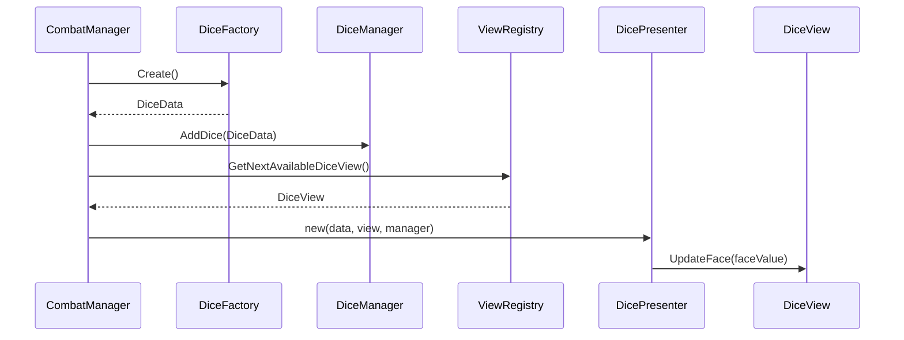
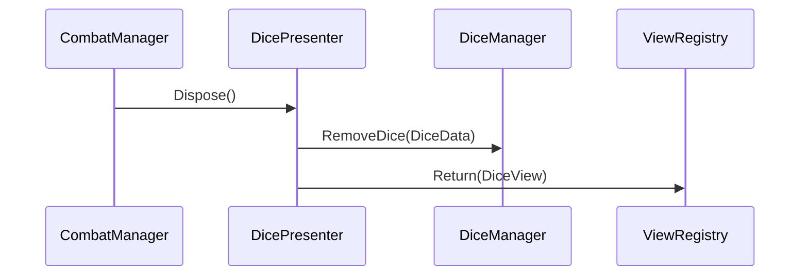

# sys_dice_lifecycle_design.md - ダイスライフサイクル設計書

---

## 概要

このドキュメントは、「CardsAndDices」プロジェクトにおけるダイスオブジェクト（`DiceData`および`DiceView`）のライフサイクル、すなわち生成、利用、返却の全プロセスに関する技術仕様を定義します。
この設計は、[guide_design-principles.md](../guide/guide_design-principles.md)で定義された「関心の分離」を徹底し、オブジェクトプーリングを前提とした堅牢で保守性の高いアーキテクチャの実現を目的とします。

---

## アーキテクチャと責務分担

ダイスのライフサイクルは、以下のコンポーネント群の協調によって実現されます。

| クラス名 | 種別 | 役割 |
| :--- | :--- | :--- |
| `CombatManager` | 既存Controller | **起点**: 戦闘フローの管理役。ダイスが必要になるタイミングを決定し、各コンポーネントに指示を出します。 |
| `ViewRegistry` | 既存Controller | **Viewプール**: `DiceView`を含む全Viewのオブジェクトプール。インスタンスの貸出・返却を管理します。 |
| `DiceManager` | 既存Controller | **データ管理**: 全ての`DiceData`インスタンスをコレクションとして保持し、状態を一元管理します。 |
| `DiceFactory` | **新規**System | **データ生成**: `DiceData`インスタンスの生成ロジックに特化したFactoryクラス。 |
| `DicePresenter` | **新規**System | **仲介役**: `DiceData`と`DiceView`を1対1で紐づけ、両者の状態を同期させる責務を持ちます。 |

---

## ライフサイクルシーケンス

### 1. 貸出 (Activation) フロー

ダイスが利用可能になるまでのシーケンスです。

1.  **`CombatManager`**がダイスの利用を決定します。
2.  `CombatManager`は`DiceFactory`に`DiceData`の生成を依頼します。
3.  生成された`DiceData`を`DiceManager`に登録します。
4.  `CombatManager`は`ViewRegistry`に利用可能な`DiceView`を要求します。
5.  `CombatManager`は取得した`DiceData`と`DiceView`を使い、`DicePresenter`を生成して両者を紐付けます。
6.  `DicePresenter`は`DiceView`の初期表示を更新します。

### 2. 返却 (Deactivation) フロー

ダイスが利用不可になるまでのシーケンスです。

1.  **`CombatManager`**がダイスの利用終了を決定します。
2.  `CombatManager`は対象の`DicePresenter`の`Dispose()`メソッドを呼び出します。
3.  `DicePresenter`は、`DiceManager`から管理下の`DiceData`を登録解除します。
4.  `DicePresenter`は、管理下の`DiceView`を`ViewRegistry`に返却します。（`ViewRegistry`がViewを非アクティブ化します）

---

## `ViewRegistry`への追加実装

既存の`ViewRegistry.cs`には、以下のメソッドを追加する必要があります。

-   `public DiceView GetNextAvailableDiceView()`
-   `public void Return(DiceView view)` (または既存の非アクティブ化ロジックを利用)

---

## 関連ファイル

- [guide_design-principles.md](../guide/guide_design-principles.md)
- [sys_dice_inlet_design.md](./sys_dice_inlet_design.md)
- [ui_dice_interaction.md](../ui/ui_dice_interaction.md)

---

## 更新履歴

- 2025-08-14: 初版 (Gemini)
