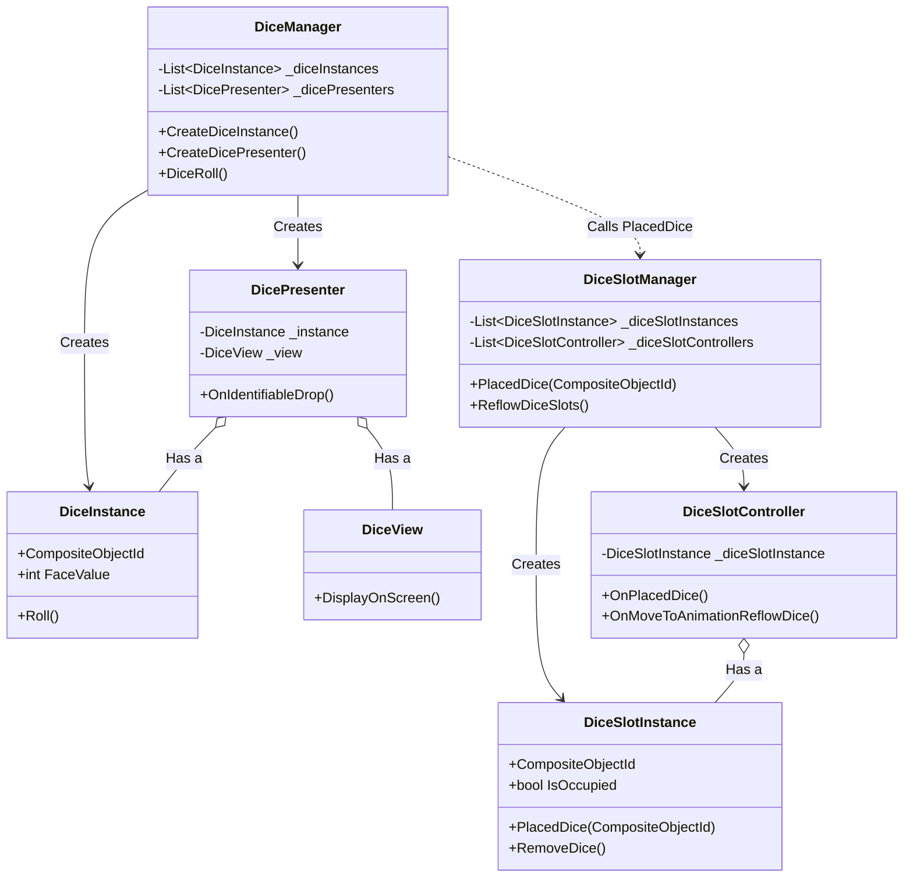

# sys_dice_management.md - ダイス管理設計書

---

## 概要

本設計は、「Cards and Dices」プロジェクトにおける「ダイス」および「ダイススロット」機能の技術的な実装を定義します。ダイスの生成、状態管理、リロール、スロットへの配置、そしてユーザーによるインタラクションまで、ダイスに関連する全てのコンポーネントとその責務、処理フローを詳述します。

---

## クラスおよびコンポーネント設計

ダイス管理システムは、MVC (Model-View-Controller) パターンに基づき、以下のクラス群で構成されます。

### 1. ランタイムインスタンス (Model)

- **`DiceInstance`**:
    - **継承**: `Pure C# Class`
    - ゲーム中に存在するダイス1つずつの実行時インスタンス。
    - **プロパティ**:
        - `CompositeObjectId`: Viewと紐づく一意なID。
        - `FaceValue`: ダイスの出目 (1-6)。
        - `IsOnScreen`: 画面上に表示されているかどうかの状態。
        - `IsAlive`: ダイスが使用可能かどうかの状態。
    - **責務**: ダイス自身の状態（出目、状態フラグ）を保持します。
    - **メソッド**:
        - `Roll()`: 出目をランダムに更新します。

- **`DiceSlotInstance`**:
    - **継承**: `Pure C# Class`
    - ダイスが配置されるスロット1つずつの実行時インスタンス。
    - **プロパティ**:
        - `CompositeObjectId`: Viewと紐づく一意なID。
        - `DiceSlotPosition`: スロットの物理的な位置(Vector3)。
        - `DiceSlotLocation`: スロットの論理的な場所を示すEnum。
        - `PlacedDiceId`: 現在このスロットに配置されているダイスのID。
        - `IsOccupied`: ダイスが配置されているかどうかを示す真偽値。
    - **責務**: スロット自身の状態（どのダイスが配置されているか）を保持します。
    - **メソッド**:
        - `PlacedDice(diceId)`: 指定されたダイスをスロットに配置します。
        - `RemoveDice()`: 配置されているダイスをスロットから取り除きます。

### 2. 仲介クラス (Presenter / Controller)

- **`DicePresenter`**:
    - **継承**: `Pure C# Class`
    - `DiceInstance` (Model) と `DiceView` (View) を1対1で繋ぐ仲介クラス。
    - **責務**:
        - `GameEventBus` を購読し、自身の管理するViewに関連するイベント（`DisplayOnScreenEvent`, `IdentifiableDropEvent`など）を監視します。
        - イベントに応じて `DiceInstance` の状態を更新したり、`DiceView` の表示（アニメーションなど）を制御したりします。
    - **メソッド**:
        - `OnIdentifiableDrop(...)`: ダイスがインレットなどにドロップされた際の処理。`DiceDropInInletCommand` を発行し、インレットシステムに通知します。
        - `OnDisplayOnScreen(...)`: ダイスを画面に登場させるアニメーションをViewに指示します。

- **`DiceSlotController`**:
    - **継承**: `Pure C# Class`
    - `DiceSlotInstance` の状態変更を管理するクラス。
    - **責務**:
        - `GameEventBus` を購読し、自身の管理するスロットに関連するイベント（`PlacedDiceEvent`, `MoveToAnimationReflowDiceEvent`など）を監視します。
        - イベントに応じて `DiceSlotInstance` の状態を更新し、必要であれば他のイベント（`MoveToIdentifiableEvent`など）を発行してViewの表示を制御します。
    - **メソッド**:
        - `OnPlacedDice(...)`: スロットにダイスが配置された際の処理。`DiceSlotInstance` の状態を更新します。
        - `OnMoveToAnimationReflowDice(...)`: リフロー時にダイスをスロット位置へ移動させるアニメーションイベントを発行します。

### 3. 管理クラス (Controller)

- **`DiceManager`**:
    - **継承**: `ScriptableObject`
    - 全ての `DiceInstance` と `DicePresenter` のライフサイクルを一元管理するマネージャークラス。
    - **責務**:
        - `DiceInstance` と `DicePresenter` を生成し、リストに登録・解除します。
        - `GameEventBus` を購読し、`CombatPhaseDiceRollEvent` を監視します。
        - コマンド受信時、`DiceRoll()` を実行し、ダイスの生成、配置、表示の一連のフローを開始します。

- **`DiceSlotManager`**:
    - **継承**: `ScriptableObject`
    - 全ての `DiceSlotInstance` と `DiceSlotController` のライフサイクルを一元管理するマネージャークラス。
    - **責務**:
        - `SceneLoadedEvent` に応じて、シーンに存在する全ての `DiceSlotInstance` と `DiceSlotController` を生成します。
        - ダイス配置のロジックを担当します。`PlacedDice()` メソッドは、空いているスロットを探し、そこにダイスを配置するための `PlacedDiceEvent` を発行します。
        - ダイススロットのリフロー処理 (`ReflowDiceSlots`) を担当します。

---

## 主要な処理フロー

### 1. ダイスの生成と配置 (ターン開始時)

1.  `CombatPhaseDiceRollEvent` が `GameEventBus` を介して発行されます。
2.  `DiceManager` はこのイベントを受信し、`DiceRoll()` メソッドを呼び出します。
3.  `DiceRoll()` 内で、`IdentifiableViewRegistry` からバインドされていない `DiceView` を取得します。
4.  `DiceManager` は `CreateDiceInstance()` で `DiceInstance` を生成し、`CreateDicePresenter()` で `DicePresenter` を生成して、InstanceとViewを紐付けます。
5.  `DiceManager` は `DiceSlotManager.PlacedDice()` を呼び出し、生成したダイスの配置を依頼します。
6.  `DiceSlotManager` は空いているスロットを検索し、そのスロットのIDとダイスのIDを含んだ `PlacedDiceEvent` を発行します。
7.  該当する `DiceSlotController` が `PlacedDiceEvent` を受信し、自身の管理する `DiceSlotInstance` の `PlacedDiceId` を更新します。
8.  最後に `DiceManager` が `DisplayOnScreenEvent` を発行します。
9.  `DicePresenter` がこれを受信し、担当する `DiceView` に画面上へ移動するよう指示します。

### 2. ダイスの使用 (インレットへのドロップ)

1.  プレイヤーが `DiceView` をドラッグし、`InletView` の上でドロップします。
2.  `DiceView` にアタッチされた `IdentifiableInputHandler` が `IdentifiableDropEvent` を発行します。このイベントには、ドラッグされたオブジェクト（ダイス）とドロップ先オブジェクト（インレット）の `CompositeObjectId` が含まれます。
3.  ダイスに対応する `DicePresenter` がこのイベントを受信します。
4.  `OnIdentifiableDrop()` メソッド内で、`DicePresenter` は `DiceDropInInletCommand` を発行します。このコマンドには、ダイスの出目(`FaceValue`)が含まれており、インレットの能力発動システムが後続処理を行います。
5.  `DicePresenter` は、使用済みとなった `DiceInstance` の `IsAlive` フラグを `false` に更新し、`DiceView` を非表示にするよう指示します。

---

## 既存システムとの連携

- **Identifiable View システム**: `DiceView` は `IIdentifiableView` を実装しており、`CompositeObjectId` によって一意に識別されます。ユーザーの入力は `IdentifiableInputHandler` によって検知され、`IdentifiableDropEvent` などのイベントに変換されます。
- **イベントバスシステム**: ダイス管理システムの全てのコンポーネントは、`GameEventBus` を介して疎結合に連携します。`DiceManager` や `DicePresenter` はイベントを発行・購読することで、互いを直接参照することなく処理を連鎖させます。
- **インレットシステム**: ダイスが使用されると、`DicePresenter` は `DiceDropInInletEvent` を発行します。このコマンドをインレット側のシステムが購読することで、ダイスの出目に応じた能力発動のロジックが実行されます。

---

## 関連ファイル

- [gdd_combat_system.md](../../gdd/gdd_combat_system.md)
- [sys_identifiable-views.md](../sys/sys_identifiable-views.md)

---

## 更新履歴

- 2025-09-22: 初版 (Gemini)
