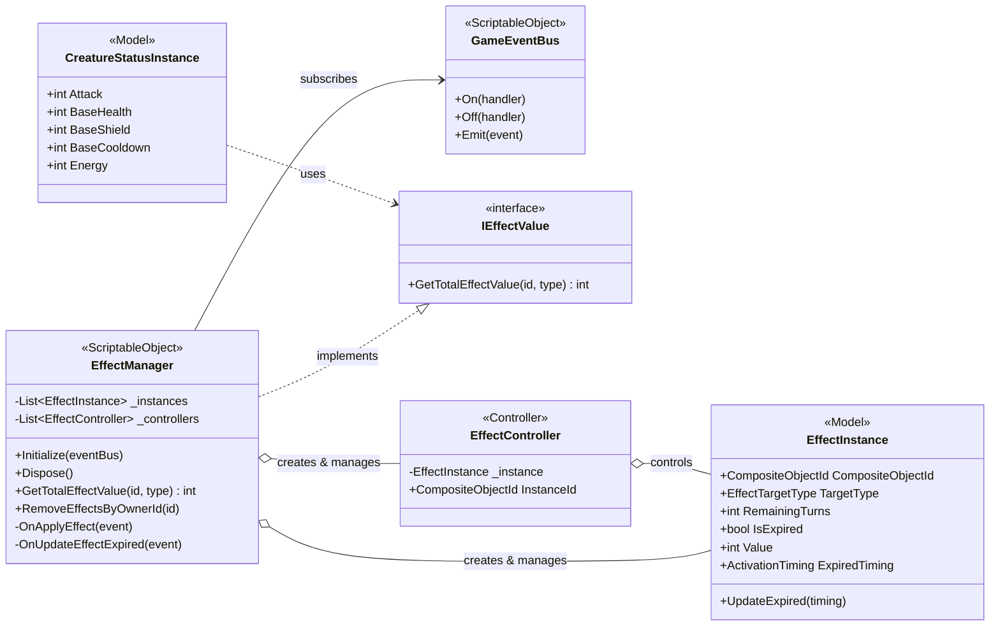

# sys_effect_system.md - エフェクト管理システム設計書

---

## 概要

本設計は、「Cards and Dices」プロジェクトにおいて、クリーチャーに適用される一時的なステータス変化（バフ・デバフ）のライフサイクルを管理するための「エフェクト管理システム」の技術的な実装を定義します。

本システムは、プロジェクトの基本原則である「関心の分離」「データ駆動」「イベント駆動」に厳密に従います。`EffectManager`が中央ハブとして機能し、イベントバスを介してエフェクトの適用要求を受け取り、純粋なデータクラスである`EffectInstance`を生成・管理します。ステータスの計算は、`IEffectValue`インターフェースを通じて、この`EffectManager`に問い合わせることで動的に行われます。

---

## クラスおよびコンポーネント設計

本システムは、エフェクトのライフサイクルを管理する`EffectManager`、個々のエフェクトデータを保持する`EffectInstance`、そしてインスタンスを制御する`EffectController`の3つの主要クラスで構成されます。



### 1. データモデル (Model)

- **`EffectInstance`**:
    - **継承**: `IDisposable`, `IIdentifiableInstance`
    - **プロパティ**:
        - `CompositeObjectId`: このエフェクトが適用されている対象のオブジェクトID。
        - `TargetType`: エフェクトが影響を与えるステータスの種類（例: `Attack`, `Health`）。
        - `RemainingTurns`: エフェクトが持続する残りターン数。
        - `IsExpired`: エフェクトが有効期限切れかどうかを示すフラグ。
        - `Value`: エフェクトによるステータスの変化量。
        - `ExpiredTiming`: エフェクトの有効期限がチェックされるタイミング（例: `TurnEnd`）。
    - **責務**:
        - 単一のバフ・デバフ効果の全てのデータを保持する。
        - 自身の有効期限ロジック（ターン数の減少）を管理する。
    - **メソッド**:
        - `Initialize(...)`: プロパティを初期化する。
        - `Dispose()`: 破棄処理（現在は空）。
        - `UpdateExpired(ActivationTiming expiredTiming)`: 指定されたタイミングが自身の`ExpiredTiming`と一致する場合、残りターン数を減少させ、0以下になったら`IsExpired`フラグを立てる。

### 2. 仲介クラス (Presenter / Controller)

- **`EffectController` (POCO)**:
    - **継承**: `IDisposable`, `IIdentifiableController`
    - **プロパティ**:
        - `InstanceId`: 制御対象の`EffectInstance`が持つ`CompositeObjectId`。
        - `_instance`: 制御対象の`EffectInstance`への参照。
        - `_eventBus`: 参照する`GameEventBus`。
    - **責務**:
        - 特定の`EffectInstance`に紐づき、そのインスタンスに関連するイベントの購読や処理を行う（将来的な拡張用）。
    - **メソッド**:
        - `Dispose()`: イベント購読の解除など、破棄処理を行う。

### 3. マネージャークラス (Controller)

- **`EffectManager` (ScriptableObject)**:
    - **継承**: `ScriptableObject`, `IEffectValue`
    - **プロパティ**:
        - `_instances`: 現在アクティブな全`EffectInstance`のリスト。
        - `_controllers`: 生成された全`EffectController`のリスト。
        - `_eventBus`: 参照する`GameEventBus`。
    - **責務**:
        - `ApplyEffectEvent`を購読し、`EffectInstance`と`EffectController`を生成する。
        - `UpdateEffectExpiredEvent`を購読し、`EffectInstance`の有効期限を更新し、期限切れのものを破棄する。
        - `IEffectValue`インターフェースを実装し、特定のオブジェクトにかかっている特定タイプの効果の合計値を外部に提供する。
        - システム全体のエフェクトインスタンスを一元管理する。
    - **メソッド**:
        - `Initialize(GameEventBus eventBus)`: `GameEventBus`へのイベント購読を行う。
        - `Dispose()`: 全てのインスタンスとコントローラーを破棄し、イベント購読を解除する。
        - `GetTotalEffectValue(CompositeObjectId compositeObjectId, EffectTargetType type)`: 指定されたオブジェクトIDと効果タイプに一致する全てのエフェクトの`Value`の合計を返す。
        - `RemoveEffectsByOwnerId(CompositeObjectId OwnerId)`: 指定されたIDを持つオブジェクトにかかっている全てのエフェクトを削除する。
        - `OnApplyEffect(ApplyEffectEvent evt)`: イベントを受け取り、`EffectInstance`と`EffectController`を新規生成してリストに追加する。
        - `OnUpdateEffectExpired(UpdateEffectExpiredEvent evt)`: イベントを受け取り、該当するエフェクトの有効期限を更新する。
        - `DisposeEffect(EffectInstance instance)`: 指定されたインスタンスとそれに対応するコントローラーをリストから削除し、破棄する。

---

## 主要な処理フロー

### 1. エフェクトの適用と生成

1.  アビリティの発動など、何らかのゲームロジックが`ApplyEffectEvent`を`GameEventBus`に発行します。このイベントには、対象のID、効果のデータ（値、種類、持続ターン数など）が含まれます。
2.  `EffectManager`が`OnApplyEffect`メソッドでこのイベントを購読しています。
3.  `EffectManager`は、イベントの情報を基に新しい`EffectInstance`と`EffectController`を生成します。
4.  生成された`EffectInstance`と`EffectController`は、それぞれ`_instances`と`_controllers`のリストに追加され、管理下に入ります。

### 2. エフェクトの期限切れ処理

1.  ターン終了時など、特定のタイミングでシステムが`UpdateEffectExpiredEvent`を`GameEventBus`に発行します。このイベントには、トリガーとなったタイミング（例: `TurnEnd`）と、対象のオブジェクトIDが含まれます。
2.  `EffectManager`が`OnUpdateEffectExpired`メソッドでこのイベントを購読しています。
3.  `EffectManager`は、管理下の`_instances`リストから、イベントのオブジェクトIDと有効期限タイミングが一致するものを検索します。
4.  見つかった各`EffectInstance`に対して`UpdateExpired()`メソッドを呼び出し、内部の残りターン数を更新させます。
5.  `UpdateExpired()`の結果、`IsExpired`フラグが`true`になったインスタンスが見つかった場合、`EffectManager`は`DisposeEffect()`を呼び出してそのインスタンスと対応するコントローラーをリストから削除し、破棄します。

---

## IEffectValueを通した利用例

`CreatureStatusInstance`は、自身のステータスを計算する際に`IEffectValue`インターフェースを利用して、現在適用されているバフ・デバフの効果量を動的に取得します。

1.  **依存性の注入**:
    `CreatureStatusInstance`は、生成時に`IEffectValue`を実装したクラス（この場合は`EffectManager`）のインスタンスをコンストラクタ経由で受け取ります。

    ```csharp
    // CreatureStatusInstance.cs
    public CreatureStatusInstance(CompositeObjectId compositeObjectId, CreatureData data, IEffectValue iEffectValue)
    {
        // ...
        _iEffectValue = iEffectValue;
        // ...
    }
    ```

2.  **動的なステータス計算**:
    `Attack`や`BaseHealth`などのプロパティが参照されるたびに、`IEffectValue.GetTotalEffectValue`メソッドが呼び出されます。これにより、常に最新のエフェクトが反映された値が返されます。

    ```csharp
    // CreatureStatusInstance.cs
    public int Attack => _CreatureData.Attack + _iEffectValue.GetTotalEffectValue(_compositeObjectId, EffectTargetType.Attack);

    public int BaseHealth => _CreatureData.Health + _iEffectValue.GetTotalEffectValue(_compositeObjectId, EffectTargetType.Health);
    ```

    この設計により、`CreatureStatusInstance`はエフェクトの具体的な管理方法を知ることなく、自身のステータス計算にその結果だけを利用できます。`EffectManager`側でエフェクトが追加・削除されると、次のプロパティ参照時には自動的にその変更が計算結果に反映されます。

---

## 関連ファイル

-   [gdd_combat_system.md](../../gdd/gdd_combat_system.md)
-   [guide_design-principles.md](../../guide/guide_design-principles.md)
-   [sys_domain-model.md](../sys_domain-model.md)

---

## 更新履歴

-   2025-10-01: 初版作成 (Gemini)
