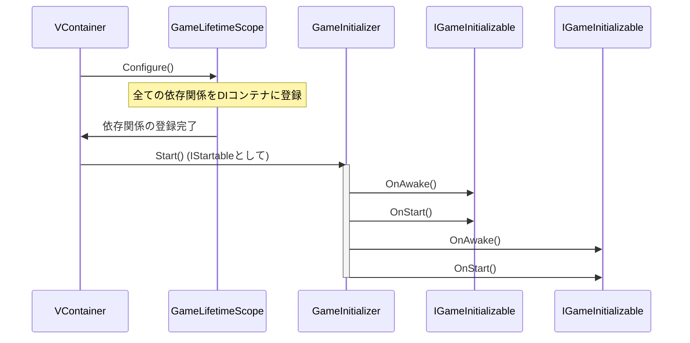

# sys_initialization_flow.md - 初期化フロー設計書

---

## 概要

このドキュメントは、ゲーム起動時の各コンポーネントの初期化順序を制御し、依存関係に起因する競合状態（Race Condition）を防ぐための仕組みについて設計します。Unityのデフォルトの実行順序（`Awake`, `Start`など）の不確実性を排除し、安定したシステム起動を実現することを目的とします。

---

## 主要コンポーネント

### 1. `IGameInitializable` (Interface)

-   **役割:** 制御された初期化処理を必要とするコンポーネントが実装すべきインターフェースです。
-   **メソッド:**
    -   `void OnAwake()`: Unityの`Awake`に相当する処理を記述します。
    -   `void OnStart()`: Unityの`Start`に相当する処理を記述します。
-   **配置場所:** `Scripts/Core/`

### 2. `GameInitializer` (ScriptableObject)

-   **役割:** `IGameInitializable`を実装したコンポーネントのリストを保持し、定義された順序で初期化処理を呼び出す責務を持ちます。
-   **実装:**
    -   VContainerの`IStartable`インターフェースを実装します。これにより、DIコンテナの構築完了後に自身の`Start()`メソッドが呼び出されることが保証されます。
    -   インスペクター上で`IGameInitializable`を持つコンポーネント（Viewなど）のリストを登録します。
    -   `Start()`メソッド内で、登録されたリストをループし、各要素の`OnAwake()`と`OnStart()`を順番に実行します。

-   **配置場所:** `Scripts/Installers/`

### 3. `GameLifetimeScope` (MonoBehaviour)

-   **役割:** VContainerのDIコンテナ設定を行うエントリーポイントです。
-   **実装:**
    -   ゲームに必要な全てのManager、Service、RepositoryなどをDIコンテナに登録します。
    -   `GameInitializer`を`IStartable`としてコンテナに登録します。

-   **配置場所:** `Scripts/Installers/`

---

## シーケンス図

---

## 関連ファイル

-   [guide_design-principles.md](../guide/guide_design-principles.md)

---

## 更新履歴

-   2025-08-22: 初版 (Gemini)
