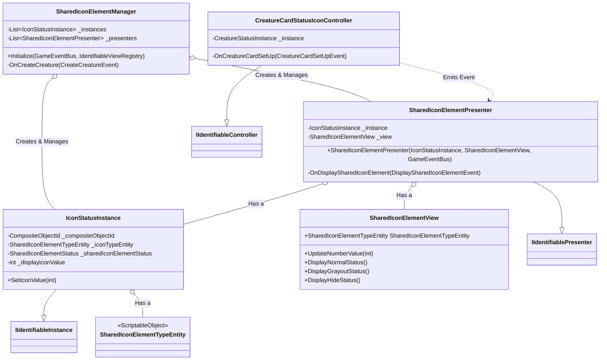

# sys_shared_icon_element_design.md - 共有アイコン要素設計書

---

## 概要

本設計は、「Cards and Dices」プロジェクトにおいて、UI上に状態を持つアイコン（例: 攻撃力、体力、シールド値）を動的に表示・更新するための汎用的な拡張機能「共有アイコン要素（Shared Icon Element）」の技術的な実装を定義します。

このシステムは、クリーチャーカードなどのUI要素に、数値やステータス（通常、グレーアウト、非表示）を持つアイコンを柔軟に追加し、それらの状態をデータと連動させることを目的とします。

---

## クラスおよびコンポーネント設計

本システムは、アイコンの状態を管理する`Model`、それを表示する`View`、両者を仲介する`Presenter`、そして全体のライフサイクルを管理する`Manager`で構成されます。

### 1. データ定義 (Model)

- **`IconStatusInstance` (POCO)**:
    - **継承**: `IDisposable`, `IIdentifiableInstance`
    - **責務**: 個々のアイコンの状態（どのオブジェクトに属するか、アイコンの種類、現在の状態、表示数値）を保持するデータクラス。
    - **プロパティ**:
        - `CompositeObjectId`: このアイコンが属する親オブジェクト（例: クリーチャーカード）のID。
        - `SharedIconElementTypeEntity`: アイコンの種類（例: 攻撃力、体力）を定義するScriptableObject。
        - `CurrentStatus` (`SharedIconElementStatus`): アイコンの現在の表示状態（`Normal`, `Grayout`, `Hide`）。
        - `DisplayiconValue`: アイコンに表示される数値。
    - **メソッド**:
        - `SetIconValue(int value)`: 表示する数値を更新します。

- **`SharedIconElementTypeEntity` (ScriptableObject)**:
    - **継承**: `BaseEntityDefinition`
    - **責務**: アイコンの種類を一意に識別するためのデータアセットです（例: 「攻撃力アイコン」「体力アイコン」）。インスペクター上で作成・管理されます。

### 2. 表示クラス (View)

- **`SharedIconElementView` (MonoBehaviour)**:
    - **責務**: `IconStatusInstance` のデータに基づき、アイコンの見た目（数値や状態）を実際に更新するコンポーネント。
    - **プロパティ**:
        - `SharedIconElementTypeEntity`: このViewがどの種類のアイコンを表示するかを定義します。インスペクターで設定されます。
    - **メソッド**:
        - `UpdateNumberValue(int value)`: 表示される数値を更新します。
        - `DisplayNormalStatus()`: アイコンを通常状態で表示します。
        - `DisplayGrayoutStatus()`: アイコンをグレーアウト状態で表示します。
        - `DisplayHideStatus()`: アイコンを非表示にします。
        - `SetBoundState(bool isBound)`: Presenterと関連付けられたかどうかを設定します。

### 3. 仲介役 (Presenter)

- **`SharedIconElementPresenter` (POCO)**:
    - **継承**: `IDisposable`, `IIdentifiablePresenter`
    - **責務**: `IconStatusInstance` (Model) と `SharedIconElementView` (View) を結びつけ、Modelの変更をViewに反映させる仲介役。
    - **プロパティ**:
        - `InstanceId`: 関連付けられた `IconStatusInstance` のID。
        - `CompositeObjectId`: 関連付けられた `SharedIconElementView` のID。
    - **メソッド**:
        - `OnDisplaySharedIconElement(DisplaySharedIconElementEvent evt)`: アイコンの表示更新イベントを購読し、イベントのIDが自身の管理するインスタンスおよびアイコン種別と一致する場合に、`IconStatusInstance` の値を更新し、`SharedIconElementView` の表示を更新させます。

### 4. 管理クラス (Manager)

- **`SharedIconElementManager` (ScriptableObject)**:
    - **継承**: `ScriptableObject`, `IDisposable`
    - **責務**: システム全体の `IconStatusInstance` と `SharedIconElementPresenter` の生成、管理、破棄を担当します。
    - **メソッド**:
        - `Initialize(...)`: `GameEventBus` と `IdentifiableViewRegistry` への参照を受け取り、イベントの購読を開始します。
        - `OnCreateCreature(CreateCreatureEvent evt)`: クリーチャー生成イベントを購読し、シーン上に存在する全ての `SharedIconElementView` に対して `IconStatusInstance` と `SharedIconElementPresenter` を生成・関連付けします。

---

## 主要な処理フロー

### 1. 初期化フロー

1.  ゲーム開始時、DIコンテナによって `SharedIconElementManager` が `Initialize` されます。
2.  `SharedIconElementManager` は `CreateCreatureEvent` を購読します。
3.  `CreateCreatureEvent` が発行されると、`OnCreateCreature` メソッドが実行されます。
4.  `IdentifiableViewRegistry` を通じて、シーンに存在する全ての `SharedIconElementView` を取得します。
5.  取得した各 `SharedIconElementView` に対して、以下の処理を行います。
    a.  `IconStatusInstance` を新規作成します。このとき、Viewの `CompositeObjectId` と `SharedIconElementTypeEntity` を引き渡します。
    b.  `SharedIconElementPresenter` を新規作成し、作成した `IconStatusInstance` と `SharedIconElementView` を関連付けます。
    c.  `SharedIconElementView` の `SetBoundState(true)` を呼び出し、関連付けが完了したことを示します。

### 2. 表示更新フロー (CreatureCardStatusIconControllerからの使用例)

`CreatureCardStatusIconController` がクリーチャーのステータス変更を検知し、対応するアイコンの表示を更新する際のフローは以下の通りです。

1.  `CreatureCardStatusIconController` は、管理対象の `CreatureStatusInstance` の変更を監視します（この例では `CreatureCardSetUpEvent` を購読）。
2.  `OnCreatureCardSetUp` イベントハンドラ内で、イベントの対象IDが自身の管理するクリーチャーIDと一致することを確認します。
3.  コントローラーは、更新したいステータス（例: `_instance.Attack`）と、それに対応するアイコンの種類（`iconData._sharedIconElementTypeEntity`）をペイロードに含んだ `DisplaySharedIconElementEvent` を `GameEventBus` に発行します。
4.  `SharedIconElementPresenter` が `DisplaySharedIconElementEvent` を受信します。
5.  Presenterは、イベントの `ExecutedObjectId` と `SharedIconElementTypeEntity` が、自身の管理する `IconStatusInstance` のものと一致するかを検証します。
6.  一致した場合、Presenterは以下の処理を実行します。
    a.  `_instance.SetIconValue(evt.NumberValue)` を呼び出し、Modelのデータを更新します。
    b.  `_view.UpdateNumberValue(evt.NumberValue)` を呼び出し、Viewの数値表示を更新します。
    c.  `DisplayCurrentStatus()` を呼び出し、Modelの `CurrentStatus` に基づいてViewの表示状態（Normal, Grayout, Hide）を更新します。

---

## 関連ファイル

- [sys_identifiable-views.md](./sys_identifiable-views.md)
- [gdd_combat_system.md](../gdd/gdd_combat_system.md)

---

## 更新履歴

- 2025-09-29: 初版 (Gemini)
