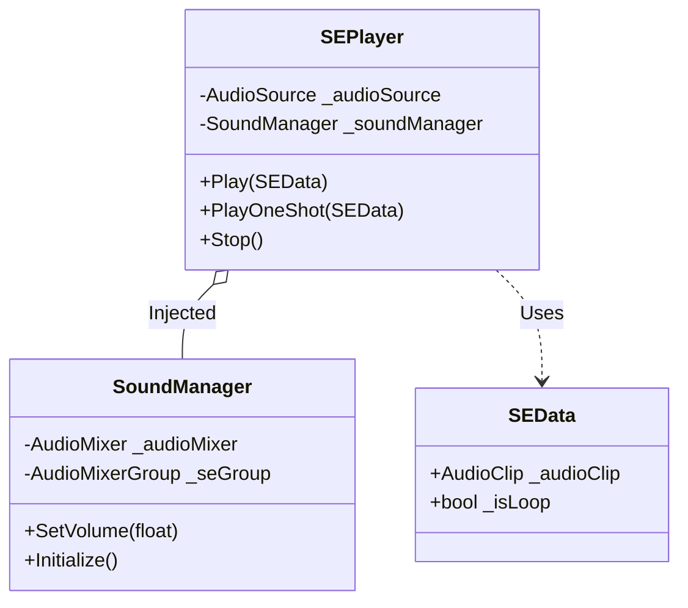

# sys_sound_system.md - 効果音管理システム設計書

---

## 概要

本設計は、「Cards and Dices」プロジェクトにおける効果音（SE）の再生と設定管理機能に関する技術的な実装を定義します。イベントに応じたSEの再生、およびゲーム全体での音量設定の永続化まで、SEに関連する全てのコンポーネントとその責務、処理フローを詳述します。

---

## クラスおよびコンポーネント設計

本システムは、サウンド設定を管理する中央マネージャー、再生データを定義するデータコンテナ、そして実際に音を再生するコンポーネントの3つの主要クラスで構成されます。

### 1. データ定義 (Model)

- **`SEData` (ScriptableObject)**:
    - **継承**: `ScriptableObject`
    - 再生するSE（サウンドエフェクト）の不変なデータを保持するコンテナです。
    - **プロパティ**:
        - `_audioClip`: 再生する `AudioClip` アセット。
        - `_isLoop`: ループ再生するかどうかの真偽値。
    - **責務**: 個々の効果音（例: 「カードを引く音」「決定音」）のオーディオデータと再生方法を定義します。`SEPlayer` に渡すことで再生されます。

### 2. 再生コンポーネント (Domain)

- **`SEPlayer` (MonoBehaviour)**:
    - **継承**: `MonoBehaviour`
    - SEの再生を実際に担当する汎用コンポーネントです。`AudioSource` コンポーネントが必須となります。
    - **プロパティ**:
        - `_audioSource`: SEを再生するための `AudioSource` コンポーネント。
        - `_soundManager`: DIコンテナから注入される `SoundManager` のインスタンス。
    - **責務**: 
        - `SEData` を受け取り、アタッチされた `AudioSource` を使ってサウンドを再生します。
        - 初期化時に `SoundManager` から `AudioMixerGroup` を取得し、自身の `AudioSource` に設定することで、中央の音量制御下に置かれます。
    - **メソッド**:
        - `Play(SEData)`: 指定されたSEを再生します。ループ設定が反映されます。
        - `PlayOneShot(SEData)`: 指定されたSEを重複再生可能な方法で一度だけ再生します。ループ設定は無視されます。
        - `Stop()`: 現在再生中のサウンドを停止します。

### 3. 管理クラス (Controller)

- **`SoundManager` (ScriptableObject)**:
    - **継承**: `ScriptableObject`
    - ゲーム全体のサウンド設定（特に音量）を一元的に管理する中央マネージャークラス。
    - **プロパティ**:
        - `_audioMixer`: ゲーム全体のオーディオを制御する `AudioMixer` アセット。
        - `_seGroup`: SEカテゴリの出力を担当する `AudioMixerGroup`。
        - `SEGroup` (public): `SEPlayer` が参照するための `_seGroup` の公開プロパティ。
    - **責務**:
        - SEの音量を設定し、その値を `PlayerPrefs` に永続化します。
        - ゲーム起動時に `PlayerPrefs` から音量設定を読み込み、`AudioMixer` に適用します。
        - `SEPlayer` に対して、SE用の `AudioMixerGroup` を提供します。
    - **メソッド**:
        - `Initialize()`: DIコンテナによって呼び出され、音量設定の読み込みと適用を行います。
        - `SetVolume(float linearVolume)`: 0.0から1.0の線形値で音量を設定し、`PlayerPrefs` に保存します。

---

## 主要な処理フロー

### 1. 初期化フロー

1.  DIコンテナ（VContainer）によって `SoundManager` の `Initialize()` メソッドが呼び出されます。
2.  `SoundManager` は `PlayerPrefs` から保存された音量設定を読み込み、`AudioMixer` のSE音量パラメータに適用します。
3.  シーン内の `GameObject` にアタッチされた `SEPlayer` が生成されると、DIコンテナが `Construct()` メソッドを呼び出し、`SoundManager` のインスタンスを注入します。
4.  `SEPlayer` は、注入された `SoundManager` から `SEGroup` プロパティを取得し、自身の `AudioSource` コンポーネントの `outputAudioMixerGroup` に設定します。

### 2. SE再生フロー

1.  UIのボタンクリックなど、SEを再生したい何らかのイベントが発生します。
2.  イベントを処理するクラスが、再生したい `SEData` アセットの参照を取得します。
3.  そのクラスは、シーン内の `SEPlayer` コンポーネント（例: UIのボタン自体にアタッチされている、あるいは特定のSE再生用GameObjectにアタッチされている）の参照を取得します。
4.  取得した `SEPlayer` の `PlayOneShot(seData)` または `Play(seData)` メソッドを呼び出します。
5.  `SEPlayer` は、受け取った `SEData` から `AudioClip` を取り出し、自身の `AudioSource` を通じて再生します。この際、再生音は初期化時に設定された `AudioMixerGroup` を経由するため、`SoundManager` で設定された音量が適用されます。

---

## 既存システムとの連携

- **イベントバスシステム**: 各所で発生するゲーム内イベント（例: `CardPlayedEvent`, `DamageTakenEvent`）を購読する専用の`SEEventHandler`（本設計書範囲外）のようなクラスを作成することで、イベントに応じたSE再生を疎結合に実現できます。`SEEventHandler` は `GameEventBus` からイベントを受け取り、対応する `SEData` を `SEPlayer` に渡して再生を指示します。
- **DIコンテナ (VContainer)**: `SoundManager` のインスタンスはDIコンテナによって管理され、`SEPlayer` などの依存コンポーネントに自動的に注入されます。これにより、コンポーネント間の結合度が低く保たれます。

---

## 関連ファイル

- [guide_design-principles.md](../../guide/guide_design-principles.md)

---

## 更新履歴

- 2025-09-22: 初版 (Gemini)
