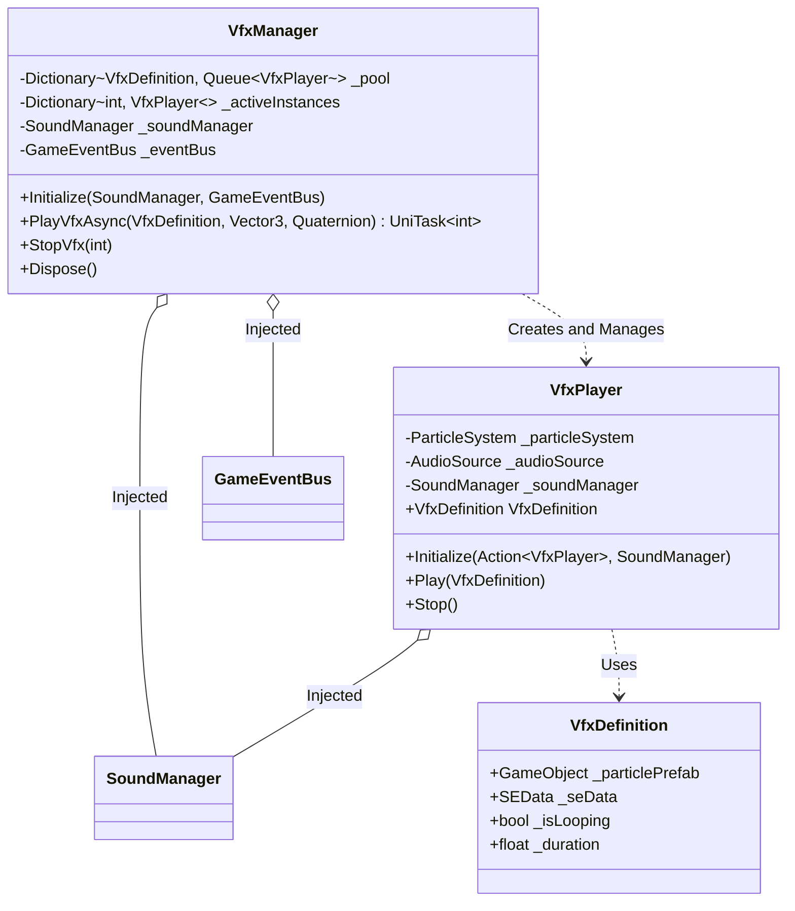

# sys_vfx_system.md - VFXおよび効果音管理システム設計書

---

## 概要

本設計は、「Cards and Dices」プロジェクトにおけるVFX（パーティクルエフェクト）および、それに付随する効果音（SE）の再生と管理機能に関する技術的な実装を定義します。オブジェクトプールを用いた効率的なリソース管理、イベント駆動による再生トリガー、再生インスタンスのライフサイクル管理まで、VFXに関連する全てのコンポーネントとその責務、処理フローを詳述します。

---

## クラスおよびコンポーネント設計

本システムは、VFXの定義を行うデータコンテナ、個々のVFX再生を担うコンポーネント、そして全体の再生とプールを管理する中央マネージャーの3つの主要クラスで構成されます。

### 1. データ定義 (Model)

- **`VfxDefinition` (ScriptableObject)**:
    - **継承**: `BaseEntityDefinition`
    - 再生するVFXの不変なデータを保持するコンテナです。パーティクルとSEを一体として扱います。
    - **プロパティ**:
        - `_particlePrefab`: 再生するパーティクルエフェクトの `GameObject` プレハブ。
        - `_seData`: 同時に再生する `SEData` アセット。
        - `_isLooping`: エフェクトをループ再生するかどうかの真偽値。
        - `_duration`: ループしない場合のエフェクト停止までの時間。0以下の場合は `ParticleSystem` の設定に依存します。
    - **責務**: 個々のVFX（例: 「攻撃ヒットエフェクト」「カード破壊エフェクト」）の視覚・聴覚データを定義します。`VfxPlayer` に渡すことで再生されます。

### 2. 再生コンポーネント (Domain)

- **`VfxPlayer` (MonoBehaviour)**:
    - **継承**: `MonoBehaviour`
    - 個々のVFXインスタンスの再生とライフサイクルを管理するコンポーネントです。`VfxManager` によって動的に生成された `GameObject` にアタッチされます。
    - **必須コンポーネント**: `ParticleSystem`, `AudioSource`
    - **プロパティ**:
        - `VfxDefinition` (public get): 現在再生中のVFX定義。
        - `_particleSystem`: パーティクル再生用の `ParticleSystem`。
        - `_audioSource`: SE再生用の `AudioSource`。
        - `_soundManager`: DIコンテナから注入される `SoundManager` のインスタンス。
    - **責務**:
        - `VfxDefinition` を受け取り、パーティクルとサウンドを再生します。
        - 再生が完了（非ループ時）または `Stop()` が呼ばれた際に、`VfxManager` に自身の終了をコールバックで通知し、プールへの返却を促します。
    - **メソッド**:
        - `Initialize(Action<VfxPlayer> onFinishedCallback, SoundManager soundManager)`: `VfxManager` から呼び出され、終了コールバックと `SoundManager` を設定します。
        - `Play(VfxDefinition vfxDefinition)`: 指定された定義に基づいてVFX（パーティクルとSE）の再生を開始します。
        - `Stop()`: 現在再生中のパーティクルとSEを停止し、終了コールバックを呼び出します。

### 3. 管理クラス (Controller)

- **`VfxManager` (ScriptableObject)**:
    - **継承**: `ScriptableObject`, `IDisposable`
    - 全てのVFX再生要求を受け付け、オブジェクトプールを用いて `VfxPlayer` インスタンスを効率的に管理する中央マネージャークラス。
    - **プロパティ**:
        - `_pool`: `VfxDefinition` ごとに `VfxPlayer` の待機インスタンスを保持するキュー。
        - `_activeInstances`: 現在再生中の `VfxPlayer` をインスタンスIDをキーに保持する辞書。
        - `_soundManager`: DIで注入される `SoundManager`。
        - `_eventBus`: DIで注入される `GameEventBus`。
    - **責務**:
        - `PlayVfxEvent` を購読し、イベントに応じたVFX再生をトリガーします。
        - `VfxPlayer` のオブジェクトプールを管理し、必要に応じて新規生成または再利用を行います。
        - 再生中のVFXインスタンスを追跡し、外部からIDで停止できるようにします。
        - プールされた `GameObject` の親として振る舞う `VfxPool` オブジェクトをシーンに生成・管理します。
    - **メソッド**:
        - `Initialize(SoundManager soundManager, GameEventBus eventBus)`: DIコンテナによって呼び出され、依存性の注入とイベントの購読設定を行います。
        - `PlayVfxAsync(VfxDefinition, Vector3, Quaternion)`: `VfxPlayer` をプールから取得または新規生成し、指定した位置・回転で再生を開始します。再生インスタンスに一意のIDを割り当てて返します。
        - `StopVfx(int instanceId)`: 指定されたインスタンスIDに対応する `VfxPlayer` の再生を停止させます。
        - `Dispose()`: `GameEventBus` の購読を解除します。

---

## 主要な処理フロー

### 1. 初期化フロー

1.  DIコンテナ（VContainer）が `VfxManager` のインスタンスを生成し、`Initialize()` メソッドを呼び出して `SoundManager` と `GameEventBus` を注入します。
2.  `VfxManager` は、シーンに `VfxPool` という名前の `GameObject` を生成し、`DontDestroyOnLoad` を設定します。このオブジェクトが、プールされる全てのVFXインスタンスの親となります。
3.  `VfxManager` は `GameEventBus` の `PlayVfxEvent` を購読します。

### 2. VFX再生フロー (イベント経由)

1.  システムのどこかで `PlayVfxEvent` が発行されます。このイベントには `VfxDefinition`、再生位置、回転が含まれます。
2.  `VfxManager` が `OnPlayVfx` メソッドでイベントを検知します。
3.  `VfxManager` は `PlayVfxAsync` を呼び出します。
4.  `GetFromPool` メソッド内で、対象の `VfxDefinition` に対応するプールを探します。
    -   **プールに待機インスタンスがある場合**: キューから `VfxPlayer` を取り出して再利用します。
    -   **プールが空の場合**: `VfxDefinition` の `ParticlePrefab` から新しい `GameObject` をインスタンス化し、`VfxPlayer` コンポーネントを追加して初期化 (`Initialize`) します。
5.  取得した `VfxPlayer` の `GameObject` をアクティブにし、指定された位置・回転に設定します。
6.  `VfxPlayer` を `_activeInstances` 辞書に一意のインスタンスIDと共に登録します。
7.  `VfxPlayer` の `Play(vfxDefinition)` メソッドを呼び出します。
8.  `VfxPlayer` は、アタッチされた `ParticleSystem` と `AudioSource` を使って、VFXとSEの再生を開始します。

### 3. VFX停止・プール返却フロー

1.  **非ループ再生の自動停止**: `VfxPlayer` の `Play` メソッド内で、`VfxDefinition` がループ設定でない場合、`Duration` または `ParticleSystem.main.duration` の時間待機するコルーチン (`WaitForCompletion`) を開始します。時間が経過すると、`Stop()` メソッドが自動的に呼ばれます。
2.  **外部からの停止**: `VfxManager.StopVfx(instanceId)` が呼ばれると、`_activeInstances` 辞書から対象の `VfxPlayer` を見つけ、その `Stop()` メソッドを呼び出します。
3.  `VfxPlayer.Stop()` が実行されると、パーティクルとオーディオの再生を停止します。
4.  `Stop()` の最後に、初期化時に登録されたコールバック (`ReturnToPool`) を呼び出します。
5.  `VfxManager` の `ReturnToPool` メソッドが実行されます。
6.  対象の `VfxPlayer` を `_activeInstances` 辞書から削除します。
7.  `VfxPlayer` の `GameObject` を非アクティブにし、対応する `VfxDefinition` のプール（キュー）に戻します。

---

## 既存システムとの連携

- **イベントバスシステム (`GameEventBus`)**: VFX再生の主要なトリガーとして機能します。`PlayVfxEvent` を発行するだけで、どこからでもVFXを再生できるため、再生ロジックと再生要求元を疎結合に保ちます。
- **サウンドシステム (`SoundManager`)**: `VfxPlayer` は `SoundManager` からSE用の `AudioMixerGroup` を取得して `AudioSource` に設定します。これにより、VFXに付随するSEも中央の音量設定に従います。
- **DIコンテナ (`VContainer`)**: `VfxManager` への `SoundManager` と `GameEventBus` の注入を担い、システムの初期化と依存関係の解決を自動化します。

---

## 関連ファイル

- [sys_sound_system.md](./sys_sound_system.md)
- [guide_design-principles.md](../../guide/guide_design-principles.md)

---

## 更新履歴

- 2025-10-04: 初版 (Gemini)
