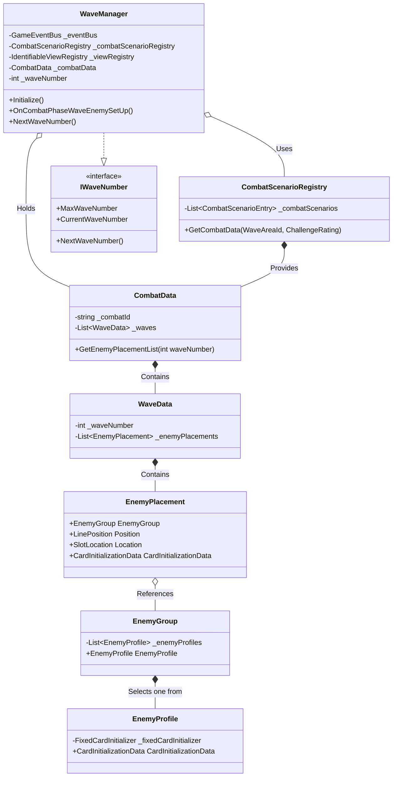

# sys_wave_system.md - Wave管理システム設計書

---

## 概要

本設計は、「Cards and Dices」プロジェクトにおいて、戦闘中のエネミークリーチャーの出現を管理する「Wave管理システム」の技術的な実装を定義します。

このシステムは、`CombatData` と呼ばれる `ScriptableObject` に基づいて、各Waveでどのエネミーがどこに配置されるかを決定し、クリーチャーカードの生成プロセスを起動する責務を負います。

---

## クラスおよびコンポーネント設計

本システムは、Waveの進行を管理する `WaveManager` と、Waveの内容を定義するデータクラス群で構成されます。

### 1. Manager / Registry

- **`WaveManager` (ScriptableObject)**:
    - **継承**: `ScriptableObject`, `IDisposable`, `IWaveNumber`
    - **プロパティ**:
        - `MaxWaveNumber`: 現在の戦闘におけるWaveの最大数。
        - `CurrentWaveNumber`: 現在のWave番号。
    - **責務**:
        - `CombatPhaseWaveEnemySetUpEvent` を購読し、Waveに応じたエネミー生成のフローを開始する。
        - `CombatScenarioRegistry` から現在の戦闘シナリオに合った `CombatData` を取得・保持する。
        - Waveの進行（`_waveNumber`）を管理する。
        - 各エネミーの配置データに基づき、クリーチャー生成関連のイベント（`CreateCreatureEvent`など）を発行する。
    - **メソッド**:
        - `Initialize(GameEventBus, CombatScenarioRegistry, IdentifiableViewRegistry)`: 依存性を注入し、イベントを購読する。
        - `OnCombatPhaseWaveEnemySetUp(CombatPhaseWaveEnemySetUpEvent)`: Waveごとのエネミー生成処理の起点となるメソッド。
        - `NextWaveNumber()`: Wave番号をインクリメントする。

- **`CombatScenarioRegistry` (ScriptableObject)**:
    - **継承**: `ScriptableObject`, `IDisposable`
    - **プロパティ**:
        - `CombatScenarios`: `CombatScenarioEntry` のリスト。
    - **責務**:
        - プロジェクトに存在する全ての `CombatData` を一元管理する。
        - `WaveAreaId` と `ChallengeRating` をキーとして、適切な `CombatData` をランダムに選択して提供する。
    - **メソッド**:
        - `GetCombatData(WaveAreaId areaId, ChallengeRating challenge)`: 条件に一致する `CombatData` を返す。

### 2. データ定義 (Data)

- **`CombatData` (ScriptableObject)**:
    - **継承**: `ScriptableObject`
    - **プロパティ**:
        - `CombatId`: 戦闘を識別するID。
        - `Waves`: この戦闘に含まれる全ての `WaveData` のリスト。
    - **責務**:
        - 1回の戦闘における全てのWave情報を保持する。
    - **メソッド**:
        - `GetEnemyPlacementList(int waveNumber)`: 指定されたWave番号に対応するエネミー配置情報のリストを返す。

- **`WaveData` (ScriptableObject)**:
    - **継承**: `ScriptableObject`
    - **プロパティ**:
        - `WaveNumber`: Waveの番号。
        - `EnemyPlacements`: このWaveで配置される全てのエネミー配置情報のリスト。
    - **責務**:
        - 1回のWaveで出現するエネミーの構成情報を保持する。

- **`EnemyPlacement` (Serializable Class)**:
    - **継承**: なし
    - **プロパティ**:
        - `EnemyGroup`: 配置されるエネミーの候補が含まれるグループ。
        - `Position`: 配置先のライン (`LinePosition`)。
        - `Location`: 配置先のスロット (`SlotLocation`)。
        - `CardInitializationData`: 生成するカードの初期化データ。
    - **責務**:
        - 「どの場所に」「どのエネミーグループから」エネミーを1体配置するかを定義する。

- **`EnemyGroup` (ScriptableObject)**:
    - **継承**: `ScriptableObject`
    - **プロパティ**:
        - `GroupName`: グループ名。
        - `EnemyProfiles`: グループに含まれるエネミープロファイルのリスト。
        - `EnemyProfile`: リストからランダムに1つ選択されたエネミープロファイル。
    - **責務**:
        - 1つの配置場所に対して、出現するエネミーのランダム性を提供する。

- **`EnemyProfile` (ScriptableObject)**:
    - **継承**: `ScriptableObject`
    - **プロパティ**:
        - `FixedCardInitializer`: カード初期化データの生成元。
        - `ChallengeRating`: 敵の難易度。
        - `EnemyRoleId`: 敵の役割。
        - `PowerLevel`: 敵の強さレベル。
        - `CardInitializationData`: 生成するカードの初期化データ。
    - **責務**:
        - 1種類のエネミーに関する詳細なデータ（クリーチャーデータ、難易度、役割など）を保持する。

### 3. インターフェース

- **`IWaveNumber`**:
    - **継承**: なし
    - **プロパティ**:
        - `MaxWaveNumber`: Waveの最大数。
        - `CurrentWaveNumber`: 現在のWave番号。
    - **責務**:
        - Waveの進行状態に関する情報を提供する責務を定義する。
    - **メソッド**:
        - `NextWaveNumber()`: Waveを次に進める。

---

## 主要な処理フロー

### エネミークリーチャー生成フロー

戦闘開始時またはWave更新時に、`CombatPhaseWaveEnemySetUpEvent` が発行された際の処理フローは以下の通りです。

1.  `GameEventBus` が `CombatPhaseWaveEnemySetUpEvent` を発行します。
2.  `WaveManager` がイベントを購読し、`OnCombatPhaseWaveEnemySetUp` メソッドが呼び出されます。
3.  `WaveManager` は `CombatScenarioRegistry` に `GetCombatData` を要求し、現在の戦闘エリアと難易度に応じた `CombatData` を取得します。
4.  `WaveManager` は取得した `CombatData` から、現在のWave番号に対応する `EnemyPlacement` のリストを取得します。
5.  リスト内の各 `EnemyPlacement` に対してループ処理を行います。
6.  `IdentifiableViewRegistry` から、まだ使用されていない `CreatureCardView` を取得します。
7.  `WaveManager` は `GameEventBus` を通じて、以下のイベントを順に発行します。
    - `CreateCreatureEvent`: クリーチャーのデータモデルを生成・初期化するよう要求します。
    - `UpdateDisplayCreatureStatusEvent`: 生成されたクリーチャーのステータスをUIに反映するよう要求します。
    - `PlacedPpecifiedSlotEvent`: クリーチャーを指定されたスロットに配置するよう要求します。

---

## 関連ファイル

- [gdd_combat_system.md](../gdd/gdd_combat_system.md)
- [sys_domain-model.md](./sys_domain-model.md)

---

## 更新履歴

- 2025-10-08: 初版 (Gemini)
